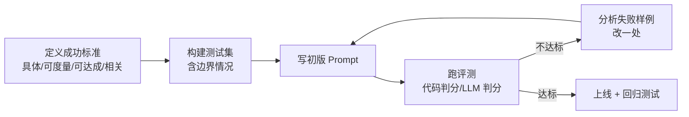

# Day 02 · Prompt 工程（2026-09-30）

## 一句话总结

Prompt 工程不是"找魔法咒语"，而是一个**有评测驱动的迭代过程**：先定义成功标准和测试集，再用清晰直接的指令、解释动机、XML 分区、3–5 个多样的示例、思考（thinking/CoT）和结构化输出把模型行为收敛到可验证的范围，每次改动都跑评测对比。

## 核心概念

### 1. 先有评测，再写 Prompt

Claude 官方的前置要求有三条：**明确的成功标准**、**能对照标准做实证测试的方法**、**一个待改进的初稿**。没有前两条，就先去补。官方还提醒：不是所有问题都该用 prompt 解决，比如延迟和成本，有时换模型更简单。



### 2. 七个核心技巧（按官方最佳实践整理）

| 技巧 | 要点 | 为什么有效 |
|---|---|---|
| 清晰直接 | 把 Claude 当成"聪明但刚入职、不了解你们规范的新员工"；有顺序要求时用编号步骤 | 模型不会读心，歧义会被随机填补 |
| 解释动机 | 不只说"不要用省略号"，而说"回答会被 TTS 朗读，TTS 不会读省略号" | 模型能从动机泛化到没写到的情况 |
| 给示例（few-shot） | **3–5 个**，要贴近真实、足够多样、用 `<example>` 包裹 | 示例是最强的格式/风格信号，但单一示例会被过度模仿 |
| XML 分区 | 指令、上下文、示例、变量输入各用标签隔开，标签名一致 | 降低"把资料当指令"的误解，也方便程序化填充 |
| 角色 | system prompt 里一句角色设定就有效果 | 激活领域知识与语气 |
| 长上下文排布 | 20k+ token 时**长资料放顶部、问题放末尾**，官方测试最多提升约 30% 质量；先让模型摘引相关原文 | 与 Day 1 的 context rot 呼应 |
| 思考 | Claude 4.6 及以后用 **adaptive thinking**（`thinking: {type: "adaptive"}` + `effort`）；关闭思考时可用 `<thinking>`/`<answer>` 标签做手动 CoT | 复杂推理先想后答 |

格式控制的两个小原则：**告诉模型要做什么，而不是不要做什么**；**prompt 本身的风格会影响输出风格**（prompt 满是 markdown，输出也容易满是 markdown）。

### 3. 结构化输出：从"求它输出 JSON"到"约束解码"

演进路线：
1. 早期：在 prompt 里写"只输出 JSON" + 正则/重试 → 不可靠。
2. 用 tool use 取结构：把 schema 当工具参数。
3. **现在：原生 Structured Outputs**。Claude API 支持 `output_config.format`（JSON Schema）或 SDK 的 `client.messages.parse(output_format=PydanticModel)`，官方保证**始终是合法 JSON、字段类型和必填项正确、不需要为 schema 违规重试**；工具也可以加 `strict: true` 严格校验参数。

仍需处理的边界：`stop_reason == "refusal"`（安全拒答时可能不符合 schema）、`"max_tokens"`（被截断），以及 schema 复杂度上限。

LangChain 侧：`model.with_structured_output(Schema)`，`method` 可选 `json_schema` / `function_calling` / `json_mode`，`include_raw=True` 可同时拿到原始消息和解析错误；Agent 用 `create_agent(response_format=...)`，支持 `ProviderStrategy`（原生能力，推荐）和 `ToolStrategy`（用工具调用模拟）。

### 4. 2026 年需要更新的认知（面试加分点）

- **Prefill（预填 assistant 开头）在 Claude 4.6+ 上已不再支持**。以前"预填 `{` 逼它出 JSON"的技巧，现在应改用结构化输出。
- 思考预算从手动 `budget_tokens` 改为 adaptive thinking + `effort`。
- 新模型更主动，以前为防"偷懒"写的强硬语气（全大写 MUST、反复强调）要**调低**，否则容易过度执行。
- 对话历史保持 **append-only**，修改之前的轮次会让后续 thinking 块失效。

### 5. 提示词迭代方法

- **一次只改一处**，每次都跑同一套评测，记录分数（像写单测一样）。
- 评测方法优先级：代码判分（精确匹配、正则）> LLM 判分（写详细 rubric，让评判模型先推理再给分）> 人工评测（尽量避免，只用于高风险场景）。官方观点：**题量大但判分略粗，好过题量少但全靠人工**。
- 失败样例分类：是指令歧义？缺上下文？示例误导？还是模型能力不足（该换模型/拆任务）？
- 复杂任务做 **prompt chaining**：拆成多个小 prompt 串联，每步可单独评测。

## 代码示例

车载语音意图识别：system prompt 用 XML 分区 + 解释动机 + few-shot，输出用 Pydantic 结构化，再跑一个迷你评测。

```python
# pip install -U anthropic pydantic ; export ANTHROPIC_API_KEY=sk-...
from typing import Literal
from anthropic import Anthropic
from pydantic import BaseModel, Field

class Intent(BaseModel):
    intent: Literal["navigate", "media", "climate", "phone", "unknown"]
    slots: dict[str, str] = Field(description="抽取到的参数，如 destination、temperature")
    reply: str = Field(description="给用户的一句简短口语回复")

SYSTEM = """你是车载语音助手的意图识别模块。
<rules>
1. 只从下列意图中选择：navigate, media, climate, phone, unknown。
2. 用户说法模糊或不在范围内时选 unknown，不要猜。误识别会让车辆执行错误操作，比识别不出更糟。
3. reply 会被 TTS 朗读给正在开车的司机，所以不超过 15 个字，不用符号和表情。
</rules>
<examples>
<example>用户：带我去最近的充电站 → navigate, destination=最近的充电站</example>
<example>用户：有点热 → climate, action=降温</example>
<example>用户：今天股票怎么样 → unknown</example>
</examples>"""

client = Anthropic()

def classify(text: str) -> Intent:
    resp = client.messages.parse(
        model="claude-sonnet-5-5",
        max_tokens=512,
        system=SYSTEM,
        messages=[{"role": "user", "content": f"<utterance>{text}</utterance>"}],
        output_format=Intent,
    )
    if resp.stop_reason in ("refusal", "max_tokens"):
        return Intent(intent="unknown", slots={}, reply="没听清，请再说一遍")
    return resp.parsed_output

# 迷你评测集：改 prompt 后重跑，看准确率是否提升
EVAL = [("导航回家", "navigate"), ("放点周杰伦", "media"),
        ("空调调到22度", "climate"), ("给老婆打电话", "phone"),
        ("帮我写首诗", "unknown"), ("冷", "climate")]

correct = 0
for text, expected in EVAL:
    got = classify(text)
    ok = got.intent == expected
    correct += ok
    print(f"{'✓' if ok else '✗'} {text} -> {got.intent} {got.slots} 「{got.reply}」")
print(f"准确率: {correct}/{len(EVAL)}")
```

运行说明：`python day02.py`。之后试着删掉 `<examples>` 或动机说明再跑，对比准确率和 reply 长度的变化。

## 与 Android / 车载场景的联系

车载意图识别的输出最终要映射成 Android 的 Intent 或车控指令，**结构化输出 + 枚举约束**就相当于给 LLM 套上了一个类型安全的接口层。"误识别比识别不出更糟"这类动机说明，在车控这种安全敏感场景尤其重要。

## 高频面试题

**Q1. 你是怎么写和迭代一个 prompt 的？**
- 先定成功标准（具体、可度量）和测试集（含边界情况），再写初稿。
- 技巧：清晰直接、解释动机、XML 分区、3–5 个多样示例、角色、必要时开思考。
- 迭代：一次改一处、跑评测对比、分析失败样例；该换模型或拆任务时不硬调 prompt。

**Q2. few-shot 示例怎么选？有什么坑？**
- 贴近真实分布、覆盖边界情况、彼此足够多样，官方建议 3–5 个，用 `<example>` 包裹。
- 坑：示例过于单一，模型会照抄格式甚至内容；示例和指令矛盾时模型往往跟示例走。

**Q3（追问）. 为什么要让模型输出 JSON？现在还需要"输出 JSON 失败就重试"吗？**
- 下游程序要解析，需要稳定的结构。
- 原生 structured outputs 是约束解码，官方保证合法 JSON 和字段类型，不再需要为 schema 违规重试。
- 但仍要处理 `refusal`、`max_tokens` 截断，以及 schema 能约束格式、不能保证内容正确（值仍可能错，需要业务校验）。

**Q4. CoT 为什么有效？什么时候不该用？**
- 让模型把中间推理写出来，相当于给它更多"计算步骤"；多步推理、数学、复杂决策收益明显。
- 代价是延迟和 token；简单分类、低延迟场景（如车载语音）不值得。新模型用 adaptive thinking，让模型自己决定想多少，用 `effort` 调节。

**Q5. 长文档问答，prompt 怎么排布？**
- 文档放顶部，用 `<document>`/`<source>` 等标签结构化，问题和指令放末尾（官方测试最多提升约 30%）。
- 先让模型摘引相关原文再回答，降低幻觉。

**Q6（场景）. 线上客服 Agent 升级到新模型后，回复变得"过度热情"，经常主动做用户没要求的操作。你怎么处理？**
- 先用评测集复现并量化问题，对比新旧模型。
- 检查 prompt 里为旧模型写的强硬语气（大写 MUST、"一定要尽可能多做"），新模型更主动，要调低。
- 明确边界："只做用户明确要求或明显必要的事；不可逆操作先征得确认"，并解释原因。
- 检查是否依赖了已不支持的技巧（如 prefill），改为结构化输出。改完跑回归测试再上线。

## 常见误区

1. **"prompt 越长越详细越好"**：无关内容会稀释注意力，还增加成本；要的是清晰和相关，不是字数。
2. **"用否定句列禁令就够了"**：官方建议说"要做什么"而非"不要做什么"，并解释原因。
3. **"没有评测也能调好 prompt"**：凭感觉改几次看起来变好，很可能只是换了一批样例；没有固定测试集就无法判断是否回退。

## 动手练习（30 分钟）

把上面的评测集扩充到 20 条（至少 5 条模糊/越界说法），然后做三组对照实验：①去掉示例；②去掉动机说明；③把规则改成全大写的强硬语气。记录每组的准确率和 reply 平均字数，写三行结论。

## 参考资料

- Prompt engineering overview：https://platform.claude.com/docs/en/build-with-claude/prompt-engineering/overview
- Prompting best practices：https://platform.claude.com/docs/en/build-with-claude/prompt-engineering/claude-prompting-best-practices
- Structured outputs：https://platform.claude.com/docs/en/build-with-claude/structured-outputs
- Define success criteria and build evaluations：https://platform.claude.com/docs/en/test-and-evaluate/develop-tests
- LangChain Structured output（create_agent response_format）：https://docs.langchain.com/oss/python/langchain/structured-output
- LangChain Models（with_structured_output）：https://docs.langchain.com/oss/python/langchain/models
