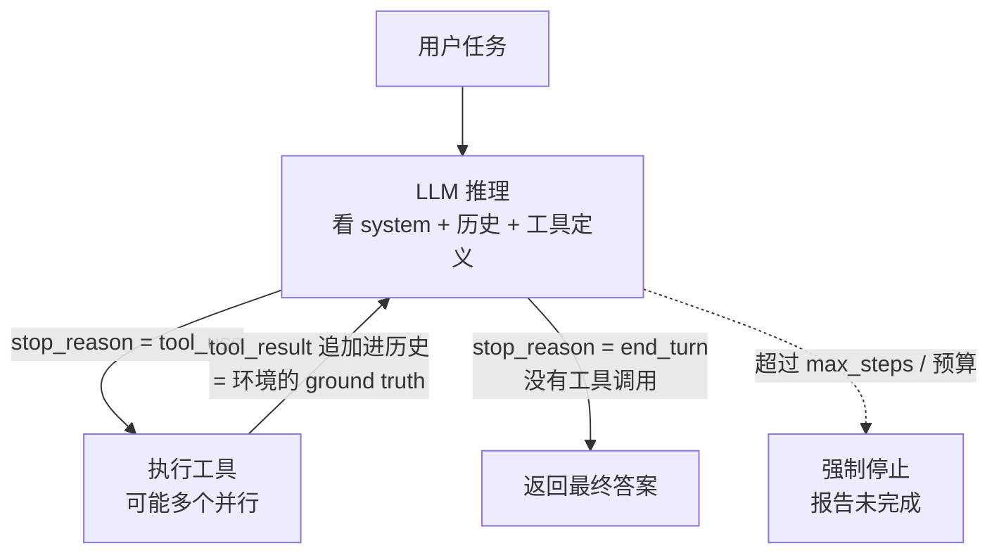

# Day 03 · 什么是 Agent（2026-10-01）

## 一句话总结

Agent 就是「**模型在循环里调用工具，直到任务完成**」：每一步由 LLM 自己决定下一步做什么，并从环境（工具结果、代码执行结果）拿到真实反馈来判断进度；而 Workflow 是**由代码预先写死路径**来编排 LLM 和工具。Agent 用延迟和成本换灵活性，所以只在步骤数无法预知的开放问题上用它，能用简单方案就别上 Agent。

## 核心概念

### 1. 定义：Agentic System 的两种形态

Anthropic《Building Effective Agents》把所有"LLM + 工具"的系统统称为 **agentic systems**，再按"控制权在谁手里"分成两类：

| | Workflow（工作流） | Agent（智能体） |
|---|---|---|
| 官方定义 | LLM 和工具通过**预定义的代码路径**编排 | LLM **动态决定**自己的流程和工具使用，自己掌控怎么完成任务 |
| 控制流在哪 | 你的代码（if/else、DAG） | 模型的每一次输出 |
| 步骤数 | 可预知、固定 | 不可预知，由模型决定何时停 |
| 优点 | 可预测、一致、易测试、便宜 | 灵活，能处理开放问题 |
| 代价 | 遇到没设计过的情况就失效 | 延迟高、成本高、错误会累积，需要更多护栏 |

LangChain 的说法几乎一致：Workflow「有预定的代码路径，按特定顺序执行」；Agent「是动态的，自己定义流程和工具使用」。LangChain v1 文档对 Agent 的一句话定义是：**"a model calling tools in a loop until a given task is complete"**，并把模型之外的一切（prompt、工具、middleware）称为 **harness（外壳/驾驭层）**。

> 面试一句话：**谁决定下一步——代码决定是 Workflow，模型决定是 Agent。** 这是一个光谱，不是二选一。

### 2. 从简单到复杂的光谱

```
单次 LLM 调用
   ↓  （加检索/工具/记忆）
Augmented LLM（增强型 LLM，所有系统的基础积木）
   ↓  （用代码把多个调用串起来）
Workflow：Prompt Chaining → Routing → Parallelization
          → Orchestrator-Workers → Evaluator-Optimizer
   ↓  （把控制流交给模型）
Agent：LLM + 工具 + 循环 + 环境反馈
   ↓
多 Agent（Day 16 讲）
```

五种 Workflow 模式本课只点名，后面会展开：Day 7（规划）、Day 8（Evaluator-Optimizer）、Day 16（Orchestrator-Workers）。

### 3. Agent Loop：核心就是一个 while 循环



Claude API 层面的精确定义（官方 "How tool use works"）：**while `stop_reason == "tool_use"`，执行工具并继续对话**。每一轮：
1. 模型返回 `tool_use` 块（可能多个，即并行调用）。
2. 你的代码执行工具，把结果包成 `tool_result` 块，放进**一条 user 消息**，`tool_use_id` 必须和对应的 `tool_use.id` 对上。
3. 把**完整历史**（包括 assistant 的 tool_use 消息）发回去，再问一次。
4. 直到 `stop_reason` 变成 `end_turn`（或 `max_tokens` / `refusal` 等，需另行处理）。

Claude Agent SDK 文档把"一次 tool 往返"叫一个 **turn**，提供 `max_turns` 和 `max_budget_usd` 两种上限，触发时返回 `error_max_turns` / `error_max_budget_usd`。LangGraph 里对应的是 `recursion_limit`，超出抛 `GraphRecursionError`。

Anthropic 在 Agent SDK 博客里把这个循环提炼成更"产品化"的三步：**收集上下文 → 采取行动 → 验证结果 → 重复**。"验证"这一步（lint、跑测试、LLM 评审）是好 Agent 和"瞎跑的 Agent"的分水岭。

### 4. 什么时候用 Agent，什么时候不该用

官方原则：**先找最简单的方案，只在必要时增加复杂度**。很多场景单次 LLM 调用 + 检索 + few-shot 就够了。

适合 Agent：
- 开放问题，**很难或不可能预知需要多少步**（如"修复这个测试失败"）。
- 无法硬编码固定路径。
- 对模型决策有足够信任，且**环境能给出可验证的反馈**（测试通过与否、API 返回）。
- 能接受更高的延迟和成本。

不该用 Agent：
- 步骤固定、可预知 → 用 Workflow，更便宜可控。
- 强实时（如车载语音 300ms 级响应）→ 多轮循环的延迟扛不住。
- 高风险、不可逆、没有沙箱和人工确认 → 错误会累积放大。
- 没有评测手段 → 无法知道 Agent 是不是真的更好。

### 5. 三条设计原则（Anthropic 官方）

1. **简单（Simplicity）**：设计保持简单；框架能加速起步，但要理解底层，抽象层会让 prompt 和响应难以调试。
2. **透明（Transparency）**：显式展示 Agent 的规划步骤，便于调试和建立信任。
3. **精心设计 ACI（Agent-Computer Interface）**：像设计人机界面一样设计工具——写清文档、充分测试，用 poka-yoke（防呆）思路改参数，让模型更难犯错（Day 5 展开）。

## 代码示例

用 Anthropic SDK 手写一个最小 Agent loop：车载场景"电量够不够到目的地，不够就找充电站"，带并行工具处理和最大步数护栏。

```python
# pip install -U anthropic ; export ANTHROPIC_API_KEY=sk-...
import json
from anthropic import Anthropic

client = Anthropic()
MODEL, MAX_STEPS = "claude-opus-5-5", 8

TOOLS = [
    {"name": "get_battery", "description": "读取当前车辆电量百分比和预估续航公里数。",
     "input_schema": {"type": "object", "properties": {}}},
    {"name": "get_route", "description": "查询到目的地的驾驶距离（公里）。",
     "input_schema": {"type": "object", "properties": {"destination": {"type": "string"}},
                      "required": ["destination"]}},
    {"name": "find_chargers", "description": "查找沿途可用的快充站，返回名称和距离。",
     "input_schema": {"type": "object", "properties": {"destination": {"type": "string"}},
                      "required": ["destination"]}},
]

def run_tool(name: str, args: dict) -> dict:  # 模拟车机接口
    if name == "get_battery":
        return {"percent": 23, "range_km": 95}
    if name == "get_route":
        return {"destination": args["destination"], "distance_km": 140}
    if name == "find_chargers":
        return {"chargers": [{"name": "服务区快充站", "km_from_here": 60}]}
    return {"error": f"unknown tool {name}"}

def agent(task: str) -> str:
    messages = [{"role": "user", "content": task}]
    for step in range(MAX_STEPS):                       # 护栏：最大步数
        resp = client.messages.create(model=MODEL, max_tokens=1024, tools=TOOLS,
            system="你是车载助手。先查数据再下结论，回答不超过 40 字。", messages=messages)
        if resp.stop_reason != "tool_use":              # end_turn 等 → 结束
            return "".join(b.text for b in resp.content if b.type == "text")
        messages.append({"role": "assistant", "content": resp.content})
        results = []
        for block in resp.content:                      # 可能一次返回多个 tool_use
            if block.type == "tool_use":
                out = run_tool(block.name, block.input)
                print(f"[step {step}] {block.name}({block.input}) -> {out}")
                results.append({"type": "tool_result", "tool_use_id": block.id,
                                "content": json.dumps(out, ensure_ascii=False)})
        messages.append({"role": "user", "content": results})  # 所有结果放一条 user 消息
    return "步数超限，任务未完成"

print(agent("我要去杭州东站，电够吗？不够的话帮我安排充电。"))
```

运行说明：`python day03.py`，观察打印的每一步——模型通常会**并行**调用 `get_battery` 和 `get_route`，发现续航不足后再调 `find_chargers`，这正是"由模型决定路径"。生产中也可以用官方 Tool Runner（`client.beta.messages.tool_runner(...).until_done()`）或 LangChain 的 `create_agent(model=..., tools=[...], system_prompt=...)` 省掉手写循环，但面试时要能手写这个 loop。

## 与 Android / 车载场景的联系

Agent loop 很像 Android 里的 `Handler/Looper`：一个循环不断取"消息"（工具调用）、分发处理、把结果投回队列，直到没有新消息。车载场景要注意：语音交互对延迟敏感，"打开空调"这种确定指令应该走 Workflow / 意图路由（Day 2 的做法），只有"规划一趟带充电的长途"这类多步开放任务才值得交给 Agent。

## 高频面试题

**Q1. 什么是 Agent？和 Workflow 有什么区别？**
- Agent：LLM 在循环中自主决定调用哪些工具、调用几次、何时结束，并依据环境反馈调整。
- Workflow：LLM 和工具按预定义代码路径编排。
- 核心区别是**控制流归属**；两者是光谱，生产系统常是混合（Workflow 外壳里嵌 Agent 节点）。

**Q2. 讲一下 Agent loop 的实现细节。**
- `while stop_reason == "tool_use"`：执行工具 → `tool_result` 放进 user 消息、`tool_use_id` 对应 → 带完整历史再次请求。
- 并行工具调用：一次响应里多个 `tool_use`，结果放在同一条 user 消息里一起回传。
- 终止条件：`end_turn` 正常结束；外加最大步数 / 预算 / 超时护栏；处理 `max_tokens`、`refusal`。

**Q3（追问）. 如果 Agent 陷入死循环，反复调用同一个工具怎么办？**
- 硬护栏：`max_turns` / `recursion_limit` / 成本预算，触发时返回明确的"未完成"状态而不是假装成功。
- 软手段：工具错误返回要有可操作信息（告诉模型错在哪、该怎么改）；检测重复调用（同名同参）并在 tool_result 里提示；改进工具描述。
- 根因：看 trace，常见是工具返回不清晰、任务描述模糊、缺少"完成标准"。

**Q4. 什么时候不该用 Agent？**
- 步骤固定可预知、强实时、高风险不可逆且无沙箱/审批、没有评测体系时。
- 官方原则：先用最简单方案（单次调用 + 检索 + 示例），确有收益再加复杂度；Agent 是"用延迟和成本换效果"。

**Q5. Agent 由哪些部分组成？**
- 模型（推理与决策）+ 工具（行动能力）+ 记忆/上下文（状态）+ 循环与终止条件 + 护栏（权限、预算、人工审批）。
- LangChain 的说法：model + harness（prompt、工具、middleware）。Anthropic 的基础积木是 Augmented LLM（检索、工具、记忆）。

**Q6（场景）. 公司想做一个"智能报销助手"，产品经理说"做成全自动 Agent"。你怎么设计？**
- 先拆需求：上传发票 → OCR 抽取 → 校验规则 → 填单 → 提交审批。主路径**步骤固定**，应做成 Workflow（prompt chaining + 结构化输出 + 规则校验门）。
- 只在开放环节用 Agent，比如"发票信息异常时，自主查询差旅记录/邮件比对原因"。
- 护栏：提交是不可逆动作 → 人工确认；设置步数和成本上限；每步可追踪。
- 用评测集对比 Workflow vs Agent 方案的准确率、成本、延迟，用数据说服 PM。

## 常见误区

1. **"用了 LangChain/工具调用就是 Agent"**：固定顺序调用几个工具是 Workflow。判断标准是"谁决定下一步"。
2. **"Agent 越自主越高级"**：自主度是成本，不是指标。官方明确建议从简单方案开始，很多生产系统用 Workflow 效果更好、更可控。
3. **"Agent 循环不需要上限，模型自己会停"**：模型可能反复重试、跑偏或撞到上下文上限，必须有步数/预算/超时护栏，并区分"成功结束"和"被迫停止"。

## 动手练习（30 分钟）

在上面的代码基础上：① 让 `get_route` 第一次调用返回 `{"error": "目的地不明确，请提供城市+地点"}`，观察模型是否会自我修正参数重试；② 把 `MAX_STEPS` 改成 1，确认程序返回"未完成"而不是空字符串；③ 用 Workflow 方式重写同一需求（固定顺序：查电量 → 查距离 → 代码判断 → 必要时查充电站 → 一次 LLM 调用组织语言），对比两者的 API 调用次数。

## 延伸学习

- Claude Academy · Building with the Claude API · Workflows vs agents：https://academy.claude.com/courses/building-with-the-claude-api/workflows-vs-agents
- Claude 官方教程 · Build a tool-using agent：https://platform.claude.com/docs/en/agents-and-tools/tool-use/build-a-tool-using-agent
- LangChain · Workflows and agents：https://docs.langchain.com/oss/python/langgraph/workflows-agents

## 参考资料

- Anthropic, Building Effective AI Agents：https://www.anthropic.com/engineering/building-effective-agents
- How tool use works：https://platform.claude.com/docs/en/agents-and-tools/tool-use/how-tool-use-works
- Tutorial: Build a tool-using agent：https://platform.claude.com/docs/en/agents-and-tools/tool-use/build-a-tool-using-agent
- Agent SDK · How the agent loop works：https://code.claude.com/docs/en/agent-sdk/agent-loop
- Building agents with the Claude Agent SDK：https://claude.com/blog/building-agents-with-the-claude-agent-sdk
- LangChain Agents（create_agent）：https://docs.langchain.com/oss/python/langchain/agents
- LangGraph Workflows and agents：https://docs.langchain.com/oss/python/langgraph/workflows-agents
- LangGraph GRAPH_RECURSION_LIMIT：https://docs.langchain.com/oss/python/langgraph/errors/GRAPH_RECURSION_LIMIT
