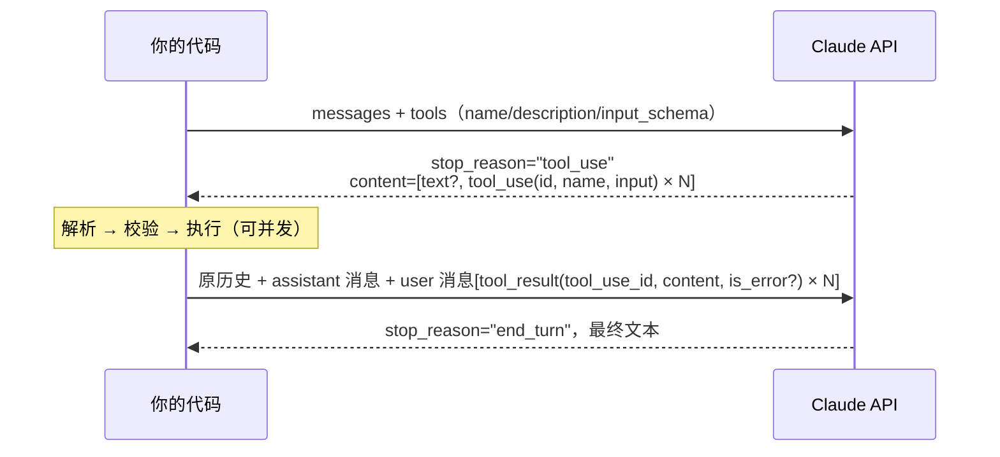

# Day 04 · Function Calling / Tool Use（2026-10-02）

## 一句话总结

Function Calling 的本质是：**模型不执行任何函数，它只输出"想调哪个工具、参数是什么"的结构化请求**（`tool_use` 块），由你的代码执行后把结果用 `tool_result` 回传；模型选工具几乎完全依赖**工具名 + 描述 + JSON Schema**，所以工具定义写得好不好，是 Tool Use 效果的第一决定因素。

## 核心概念

### 1. 调用流程（一次完整往返）

Day 3 讲了 Agent loop 的外层循环，今天放大其中"一次工具调用"的细节。



几个必须答准的细节（Claude 官方 "Handle tool calls"）：
- `tool_result` 必须**紧跟**在对应的 assistant `tool_use` 消息之后，中间不能插入别的消息。
- 在这条 user 消息里，**`tool_result` 块必须排在最前面**，任何文本只能放在它们之后，否则 400。
- 每个 `tool_use` 都要有一个对应的 `tool_result`（靠 `tool_use_id` 对上）；没执行的也要回，用 `is_error: true` 说明原因。
- `content` 可以是字符串，也可以是 `text` / `image` / `document` / `search_result` 块的数组——工具可以返回图片和文档。

### 2. 客户端工具 vs 服务端工具

| | 客户端工具（Client tools） | 服务端工具（Server tools） |
|---|---|---|
| 谁执行 | **你的应用** | Anthropic 基础设施 |
| 例子 | 自定义函数；bash、text_editor、memory、computer use 等 Anthropic 定义 schema 但你执行的工具 | web_search、web_fetch、code_execution、tool_search、MCP connector |
| 你要做什么 | 处理 `tool_use` → 回传 `tool_result` | 什么都不用做，结果直接出现在响应里 |

面试常被问"Function Calling 和 MCP 什么关系"：Function Calling 是**模型 API 层的能力**（模型会输出结构化调用）；MCP 是**工具接入的标准协议**（工具怎么被发现、怎么被调用），MCP 工具最终仍以 Function Calling 的形式交给模型（Day 14 展开）。

### 3. 工具定义：JSON Schema

```json
{
  "name": "get_weather",                       // ^[a-zA-Z0-9_-]{1,128}$
  "description": "获取指定城市当前天气……（3-4 句以上）",
  "input_schema": {
    "type": "object",
    "properties": {
      "location": {"type": "string", "description": "城市名，如 杭州"},
      "unit": {"type": "string", "enum": ["celsius", "fahrenheit"]}
    },
    "required": ["location"],
    "additionalProperties": false
  },
  "strict": true,                               // 可选：语法约束采样，保证参数严格符合 schema
  "input_examples": [{"location": "杭州", "unit": "celsius"}]  // 可选：复杂工具给示例
}
```

- **description 是"最重要的因素"**（官方原话："by far the most important factor in tool performance"）。要写清：做什么、**什么时候用、什么时候不用**、每个参数含义、限制和注意事项；官方建议**每个工具至少 3–4 句**。
- **命名用命名空间**：`github_list_prs`、`slack_send_message`，工具多时选择更不易混淆；**少而能力强**的工具优于一堆细碎工具（Day 5 展开）。
- **`input_examples`**：给复杂/嵌套参数的工具举例，每个示例都必须符合 schema，约增加 20–200 token。
- **`strict: true`**：用语法约束采样，保证 `input` 严格符合 schema、工具名一定合法——不会再出现 `passengers: "2"` 这种类型错配。要求显式写 `additionalProperties: false`，且只支持 JSON Schema 子集。

### 4. 模型如何"选工具"

模型看不到你的代码，只能看到：**system prompt + 对话 + 工具定义**（API 会把工具定义渲染进一段专门的系统提示，按模型不同约 286–500+ token，按输入 token 计费）。所以影响工具选择的因素依次是：

1. 工具描述是否清楚说明了"何时使用"；
2. 工具之间是否有职责重叠（两个都像能干这件事 → 模型摇摆）；
3. 参数 schema 是否自解释（enum、description、示例）；
4. `tool_choice` 的硬约束。

`tool_choice` 四种模式：

| 值 | 含义 |
|---|---|
| `auto` | 默认（有 tools 时）。模型自己决定调不调、调哪个 |
| `any` | 必须调用某个工具，但不指定哪个 |
| `tool` | 强制调用指定工具，如 `{"type":"tool","name":"get_weather"}` |
| `none` | 禁止调用工具（无 tools 时的默认值） |

**2026 版本的坑（面试加分点）**：
- 手动 extended thinking（`thinking: {type: "enabled"}`）下，`any` / `tool` 会直接报错，只能用 `auto` / `none`。
- 最新的 **Claude Opus 5.5 / Sonnet 5.5 等模型上 `any` 和 `tool` 会返回 400**；官方建议改用 **`auto` + strict tool use** 来保证参数合法。也就是说"强制调用某工具来拿结构化输出"这个老技巧，在新模型上应改用**原生 Structured Outputs**（Day 2 讲过）。
- 修改 `tool_choice` 会让 prompt cache 中的消息块失效（Day 13 讲缓存时会再提）。

### 5. 并行工具调用

- Claude 默认**可以在一次响应里返回多个 `tool_use` 块**。API 不规定执行顺序——并发还是串行由你决定。
- 官方建议：**独立、只读的操作并发执行**以降低延迟；**有副作用、共享状态或有顺序依赖**的工具串行执行。
- 关闭并行：`tool_choice={"type": "auto", "disable_parallel_tool_use": True}`（注意是在 `tool_choice` 里，不是顶层参数）。`auto` 时最多调一个；`any`/`tool` 时恰好调一个。
- **回传格式会反过来影响并行率**：多个结果必须放在**同一条** user 消息里；如果你拆成多条 user 消息，等于"教"模型以后少并行。
- 想让模型更积极地并行，官方给了一段 system prompt：`<use_parallel_tool_calls>…invoke all relevant tools simultaneously…</use_parallel_tool_calls>`。

### 6. 错误处理

| 情况 | 处理 |
|---|---|
| 工具执行失败（超时、5xx） | 回 `tool_result` + `is_error: true`，内容写**可操作**的错误信息；模型会据此重试或告知用户 |
| 模型给了非法工具名/缺参数 | 官方说明模型通常会自我纠正重试 2–3 次；根治办法是 `strict: true` |
| `stop_reason == "max_tokens"` | 最后一个 `tool_use` 可能被截断，不要执行，调大 `max_tokens` 重发 |
| 不信任的参数（如删除、支付） | 执行前做业务校验 / 权限检查 / 人工确认（Day 23–24） |

SDK 的 Tool Runner（`client.beta.messages.tool_runner`）会自动把工具抛出的异常包装成 `is_error: true` 的结果交给模型。LangChain 中对应的是 `ToolMessage(status="error")`。

## 代码示例

LangChain 版：`@tool` 定义 → `bind_tools(strict=True)` → 手写循环 → **并发执行并行调用** → 错误回传。

```python
# pip install -U langchain langchain-anthropic ; export ANTHROPIC_API_KEY=sk-...
from concurrent.futures import ThreadPoolExecutor
from langchain.tools import tool
from langchain_anthropic import ChatAnthropic
from langchain.messages import HumanMessage, SystemMessage, ToolMessage

@tool
def get_cabin_temp(zone: str) -> str:
    """读取车内指定区域的当前温度（摄氏度）。zone 只能是 driver 或 passenger。
    当用户询问车内冷热、或调节空调前需要了解现状时使用。不会修改任何设置。"""
    if zone not in ("driver", "passenger"):
        raise ValueError(f"zone 只能是 driver/passenger，收到 {zone}")
    return {"driver": "29.5", "passenger": "27.0"}[zone]

@tool
def get_outside_weather(city: str) -> str:
    """查询城市当前室外天气和温度。用户提到外面天气、是否开窗时使用。只读。"""
    return f"{city}：晴，33°C，AQI 45"

TOOLS = {t.name: t for t in (get_cabin_temp, get_outside_weather)}
llm = ChatAnthropic(model="claude-opus-5-5").bind_tools(list(TOOLS.values()), strict=True)

def run_one(call: dict) -> ToolMessage:
    try:
        return TOOLS[call["name"]].invoke(call)        # 传入 ToolCall → 直接得到 ToolMessage
    except Exception as e:                             # 失败也必须回一个结果
        return ToolMessage(content=f"错误：{e}", tool_call_id=call["id"], status="error")

def chat(question: str, max_steps: int = 5) -> str:
    msgs = [SystemMessage("你是车载助手，回答不超过 50 字。"), HumanMessage(question)]
    for _ in range(max_steps):
        ai = llm.invoke(msgs)
        msgs.append(ai)
        if not ai.tool_calls:                          # 没有工具调用 → 最终答案
            return ai.text
        print("本轮工具调用：", [(c["name"], c["args"]) for c in ai.tool_calls])
        with ThreadPoolExecutor() as pool:             # 只读工具 → 并发执行
            msgs.extend(pool.map(run_one, ai.tool_calls))  # 保持与 tool_calls 同序
    return "步数超限，未完成"

print(chat("我在杭州，主驾和副驾现在多少度？外面热吗？要不要开窗？"))
```

运行说明：`python day04.py`。一般能看到模型在**同一轮**发出 3 个调用（两个 `get_cabin_temp` + 一个 `get_outside_weather`），代码并发执行后一起回传。把 system 改成"zone 用中文"再跑，可以观察 `ValueError` 以 `status="error"` 回传后模型如何自我纠正。

## 与 Android / 车载场景的联系

工具定义就像 AIDL / Binder 接口描述：模型是"调用方"，只能看到接口签名和注释，看不到实现。车载场景要特别区分**只读工具**（查温度、查续航，可并行）和**有副作用工具**（开车窗、调空调，串行 + 校验 + 必要时语音二次确认）。

## 高频面试题

**Q1. Function Calling 的完整流程是什么？模型真的在"调用函数"吗？**
- 不是。模型只生成结构化的调用意图（工具名 + JSON 参数），`stop_reason="tool_use"`。
- 应用解析 → 执行 → 用 `tool_result`（`tool_use_id` 对应）回传 → 模型基于结果继续生成。
- 格式要点：结果紧跟 tool_use 消息、tool_result 排在 content 最前、每个 tool_use 都必须有结果。

**Q2. 模型是怎么决定调用哪个工具的？如何提高选择准确率？**
- 依据 system prompt、对话和工具定义（名称、描述、schema）——工具定义会被注入为系统提示。
- 提升方法：描述写清"何时用/何时不用"（≥3–4 句）、命名空间化命名、合并职责重叠的工具、参数用 enum 和示例、必要时 `input_examples`；工具太多时用 tool search 按需加载。
- 用评测集统计"工具选择正确率"做回归，而不是凭感觉改。

**Q3（追问）. 模型返回的参数类型不对或缺字段怎么办？**
- 根治：`strict: true` 语法约束采样，保证参数符合 schema（需 `additionalProperties: false`，只支持 schema 子集）。
- 兜底：执行前仍做业务校验（schema 合法 ≠ 业务合法，比如城市不存在、金额超限），失败时返回 `is_error` + 可操作的错误信息让模型重试。
- 不要在执行层"静默修正"参数，否则模型学不到，也难排查。

**Q4（追问）. 并行工具调用怎么处理？什么时候要关掉？**
- 一次响应多个 `tool_use`；独立只读操作并发执行，所有结果放在**同一条** user 消息里回传。
- 有副作用 / 有顺序依赖 / 共享状态时串行执行，或用 `disable_parallel_tool_use: true`。
- 拆成多条消息回传会降低模型后续的并行倾向。

**Q5. `tool_choice` 有哪些取值？想"强制模型输出某个 JSON 结构"该怎么做？**
- `auto` / `any` / `tool` / `none`。
- 老做法：定义一个假工具 + `tool_choice=tool` 强制调用来拿结构化数据。
- 新做法：直接用 Structured Outputs（`output_config.format` 或 `messages.parse`）；且新一代模型（Opus 5.5 / Sonnet 5.5）已不支持 `any`/`tool`，开启手动 thinking 时也不支持，应改用 `auto` + strict。

**Q6（场景）. 车机助手接了 40 个工具后，模型经常选错工具、延迟也变高。你怎么排查和优化？**
- 先量化：用 trace 统计错误类型——选错工具、参数错、该调没调、不该调乱调。
- 优化定义：合并重叠工具（如 `open_window_driver`/`open_window_passenger` → `set_window(position, level)`），重写描述、加 enum。
- 减少暴露：按意图路由先选"工具子集"（导航域/空调域/媒体域），或用 tool search 按需加载；工具定义还占 token，减少也能降延迟。
- 执行侧：只读工具并发、有副作用工具串行 + 确认；加评测集做回归。

## 常见误区

1. **"Function Calling = 模型能执行代码"**：模型只输出调用请求，执行、权限、安全全部在你这一侧，这也是 prompt injection 的防线所在（Day 23）。
2. **"description 随便写一句就行，schema 才重要"**：官方明确描述是工具效果的第一因素；一句话描述是最常见的选错工具原因。
3. **"工具失败就直接抛异常终止"**：应把错误作为 `is_error` 结果回给模型，让它重试或换方案；同时每个 `tool_use` 都必须有结果，否则下一次请求直接 400。

## 动手练习（30 分钟）

基于上面的代码：① 新增一个有副作用的工具 `set_window(position, open_percent)`，`open_percent` 用 `integer` 并限制 0–100；② 修改执行逻辑：只读工具并发，`set_window` 串行执行且执行前在终端 `input()` 二次确认，用户拒绝时回 `status="error"` 的 ToolMessage 说明"用户拒绝"；③ 统计并打印每轮工具调用数量，比较加不加官方 `<use_parallel_tool_calls>` 提示时的差异。

## 延伸学习

- Claude Academy · Building with the Claude API（第 4 模块 Tool Use with Claude，13 节）：https://academy.claude.com/courses/building-with-the-claude-api
- Claude Academy · Implementing multiple turns：https://academy.claude.com/courses/building-with-the-claude-api/implementing-multiple-turns
- Claude 官方 cookbook · Tool choice：https://platform.claude.com/cookbook/tool-use-tool-choice
- LangChain · Tools：https://docs.langchain.com/oss/python/langchain/tools

## 参考资料

- Tool use with Claude（总览）：https://platform.claude.com/docs/en/agents-and-tools/tool-use/overview
- Define tools：https://platform.claude.com/docs/en/agents-and-tools/tool-use/define-tools
- Handle tool calls：https://platform.claude.com/docs/en/agents-and-tools/tool-use/handle-tool-calls
- Parallel tool use：https://platform.claude.com/docs/en/agents-and-tools/tool-use/parallel-tool-use
- Strict tool use：https://platform.claude.com/docs/en/agents-and-tools/tool-use/strict-tool-use
- Tool runner (SDK)：https://platform.claude.com/docs/en/agents-and-tools/tool-use/tool-runner
- How to implement tool use：https://platform.claude.com/docs/en/agents-and-tools/tool-use/implement-tool-use
- Claude Academy · Building with the Claude API：https://academy.claude.com/courses/building-with-the-claude-api
- LangChain · Tools：https://docs.langchain.com/oss/python/langchain/tools
- LangChain · Models（Tool calling 一节）：https://docs.langchain.com/oss/javascript/langchain/models
- LangChain · ChatAnthropic integration：https://docs.langchain.com/oss/python/integrations/chat/anthropic
