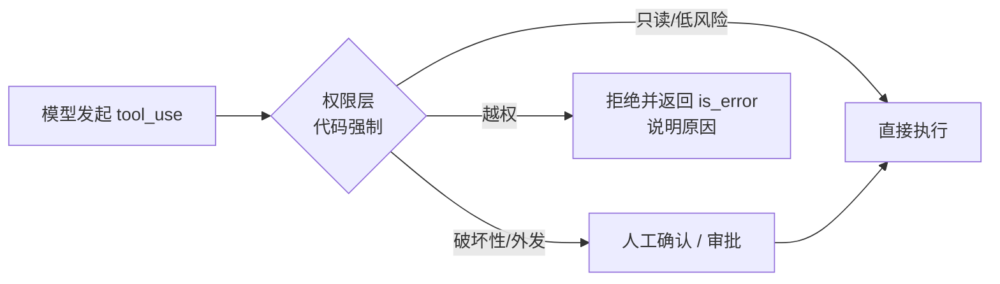

# Day 05 · 工具设计（2026-10-03）

## 一句话总结

工具是模型和外部世界之间的**接口（ACI，Agent-Computer Interface）**，要像设计给"新入职同事"用的 API 一样设计：**按任务而不是按接口粒度建工具、名字和描述把"何时用/何时不用"写清楚、返回少而有信号的结果、错误信息要告诉模型下一步怎么做、有副作用的操作做到幂等并受权限约束**——权限必须由代码强制，不能交给模型自觉。

## 核心概念

Day 4 讲的是"工具怎么被调用"（协议层），今天讲"工具该长什么样"（设计层）。Anthropic 的原话：要像投入 HCI（人机界面）那样投入 ACI，"把它当成给团队里的初级开发者写一份好的 docstring"。

### 1. 粒度：按"任务"建工具，而不是把每个 API 包一层

```
❌ 一比一包 API                         ✅ 面向任务
list_users / list_events / create_event  →  schedule_event（内部查空闲 + 创建）
list_contacts（返回全部联系人）          →  search_contacts(query)
read_logs（整段日志）                    →  search_logs(pattern, around_lines)
get_customer + get_orders + get_tickets  →  get_customer_context(customer_id)
create_pr / review_pr / merge_pr         →  github_pr(action=create|review|merge, ...)
```

- 为什么：模型的上下文是稀缺资源，人可以"翻通讯录"，Agent 每翻一页都要付 token。工具应该替模型做掉**中间步骤**，只返回它推理下一步需要的东西。
- Anthropic 原话："More tools don't always lead to better outcomes." 工具越多、职责越重叠，模型越容易选错（Day 4 Q6）。
- 但也别过度合并：一个 `do_everything(json)` 会让描述和 schema 失去约束力。**判据：一个工具 = 一个用户可理解的意图**；同一资源的多个动作可以用 `action` 枚举合并。

### 2. 命名与描述：模型只能看到这些

| 要点 | 做法 |
|---|---|
| 命名空间 | 按服务/资源加前缀：`asana_projects_search`、`slack_send_message`；官方提到前缀式还是后缀式命名对评测结果有"不可忽略"的影响，要用评测决定 |
| 命名格式 | `snake_case`，不要空格和特殊字符（LangChain 文档：有的提供方会拒绝） |
| 描述 | 每个工具至少 3–4 句：做什么、**何时用 / 何时不用**、每个参数含义、限制与注意事项（Claude 官方："by far the most important factor"） |
| 参数名无歧义 | `user_id` 而不是 `user`；`start_time_iso` 而不是 `time` |
| 能用枚举就别用自由文本 | `Literal["driver","passenger"]` → 生成 JSON Schema `enum` |
| 防呆（poka-yoke） | Anthropic 做 SWE-bench 时发现模型 `cd` 之后相对路径常出错，改成**只接受绝对路径**后这类错误直接消失——**改工具比改 prompt 更可靠** |
| 复杂参数给示例 | Claude API 的 `input_examples`（Day 4） |

### 3. 返回值：少而有信号

- **语义化标识**：给模型可读的名字/slug，而不是一串无意义的内部 ID；官方说模型处理自然语言比处理"cryptic identifiers"成功率高得多。需要下游调用的 ID 保留，但要稳定。
- **`response_format` 参数**：让模型自己选 `concise`（只要结论，例中约 72 token）或 `detailed`（含后续调用要用的 ID，约 206 token）。
- **分页 / 过滤 / 截断 + 合理默认值**：Claude Code 默认把工具返回限制在 **25,000 token**。截断时告诉模型怎么办："结果只显示前 20 条，请用更精确的关键词缩小范围。"
- **格式**：贴近自然文本/常见格式，别让模型去数行号、做大量转义（"Building Effective Agents" 附录 2）。

### 4. 错误返回：让模型能"自救"

```
❌ "Error 500"  /  "Invalid input"  /  直接抛异常让整个 Agent 崩掉
✅ "参数 date='明天' 无法解析：请使用 YYYY-MM-DD 格式，例如 2026-10-04。"
✅ "未找到名为『张三』的联系人；可先调用 contacts_search(query='张') 查看候选。"
```

- 错误信息是**给模型看的 prompt**：说明错在哪、合法取值、建议的下一步工具。
- 协议层：Claude 用 `tool_result` + `is_error: true`；LangChain 用 `ToolMessage(status="error")`，或用 `@wrap_tool_call` 中间件统一把异常转成可恢复的消息；MCP 区分**协议错误**（JSON-RPC error，如工具不存在）和**工具执行错误**（`isError: true`，结果回给模型）。
- 区分**可重试**（超时、限流 → 带退避重试或让模型稍后再试）和**不可重试**（参数非法、无权限 → 明确告诉模型别再试）。

### 5. 幂等：Agent 一定会重复调用

模型会重试、网络会超时、循环可能被恢复（checkpoint 重放，Day 17）——**同一个调用被执行两次是常态**。

| 类型 | 例子 | 设计 |
|---|---|---|
| 只读 | 查温度、搜联系人 | 天然幂等，可并发、可自动重试 |
| 设值型写操作 | `set_temperature(24)` | 天然幂等（执行两次结果一样），优先这样设计 |
| 增量型写操作 | `adjust_temperature(+2)`、`transfer(100)`、`send_message` | **不幂等**！改成设值型，或要求 `idempotency_key`，服务端去重 |

面试金句：**能设计成"设置为 X"就不要设计成"增加 X"。**

### 6. 权限边界：hint 只是提示，强制在代码



- **最小权限**：只给当前任务需要的工具；身份、租户、角色这类信息**不要作为模型可填的参数**（模型可能被注入后伪造 `user_id`），而是由运行时注入——LangChain 的 `ToolRuntime` 参数**对模型不可见**，通过 `runtime.context` 拿到调用者身份。
- **MCP 工具注解**（risk vocabulary）：`readOnlyHint`（默认 false）、`destructiveHint`（默认 true）、`idempotentHint`（默认 false）、`openWorldHint`（默认 true）——**默认值都按最坏情况假设**。客户端可据此决定是否弹确认框、套用策略。
- 但 MCP 规范明确说注解"不保证忠实描述工具行为"：不可信的 server 完全可以把删文件的工具标成只读。**注解用于 UX 和策略分级，安全靠宿主侧的权限控制和沙箱。**
- **"致命三要素"（lethal trifecta）**：同一会话里同时具备 ① 访问私有数据 ② 接触不可信内容 ③ 对外通信能力，就构成数据外泄条件（Day 23 展开）。工具组合设计时要避免三者同时出现，或在出现时收紧审批。

### 7. 怎么知道工具设计得好不好：评测驱动

Anthropic 的流程：快速做原型 → 构造**需要多次工具调用、结果可验证**的真实任务集 → 跑 Agent、记录轨迹 → 统计正确率、工具调用次数、token、错误类型 → **让 Claude 读 transcript 找工具的毛刺并改写描述** → 回归。官方提到仅靠精修工具描述，Claude Sonnet 3.5 就在 SWE-bench Verified 上拿到当时 SOTA。（Day 21 评测专题展开。）

## 代码示例

LangChain v1 `create_agent`：面向任务的工具 + 枚举参数 + `response_format` + 截断提示 + 幂等设值 + 运行时注入身份做权限 + 中间件统一错误回传。

```python
# pip install -U langchain langchain-anthropic ; export ANTHROPIC_API_KEY=sk-...
from dataclasses import dataclass
from typing import Literal
from langchain.agents import create_agent
from langchain.agents.middleware import wrap_tool_call
from langchain.messages import ToolMessage
from langchain.tools import tool, ToolRuntime

@dataclass
class Ctx:
    role: Literal["driver", "passenger"]           # 调用者身份由运行时注入，模型看不到也改不了

SONGS = [f"周杰伦-歌曲{i}" for i in range(1, 60)]

@tool
def media_search_songs(query: str, limit: int = 10,
                       response_format: Literal["concise", "detailed"] = "concise") -> str:
    """按关键词搜索本地曲库（歌名或歌手）。用户想听某首歌/某位歌手时先用它找候选，
    再用 media_play 播放。不用于在线搜索。limit 最大 20；concise 只返回歌名，
    detailed 额外返回 media_play 需要的 song_id。"""
    hits = [s for s in SONGS if query in s]
    shown = hits[: min(limit, 20)]
    lines = [f"{s} (song_id={SONGS.index(s)})" if response_format == "detailed" else s for s in shown]
    if len(hits) > len(shown):                       # 截断时告诉模型下一步怎么做
        lines.append(f"……共 {len(hits)} 条，仅显示 {len(shown)} 条。请用更具体的歌名缩小范围。")
    return "\n".join(lines) or f"没有匹配『{query}』的歌曲，可尝试只用歌手名搜索。"

@tool
def climate_set_temperature(zone: Literal["driver", "passenger"], celsius: float,
                            runtime: ToolRuntime[Ctx]) -> str:
    """把指定区域空调设置为目标温度（16–30℃）。这是设值操作，重复调用结果相同。
    用户说"调到 X 度"时直接用；说"热一点/冷一点"时先估算目标值再设置，不要累加。"""
    if runtime.context.role == "passenger" and zone == "driver":
        raise PermissionError("副驾乘客无权调节主驾温区。请告知用户只能调节副驾，不要重试。")
    if not 16 <= celsius <= 30:
        raise ValueError(f"温度 {celsius} 超出范围，合法范围 16–30℃，请换一个值重试。")
    return f"{zone} 温区已设为 {celsius}℃"

@wrap_tool_call
def errors_to_model(request, handler):
    try:
        return handler(request)
    except Exception as e:                           # 异常 → 可操作的错误消息，Agent 不崩
        return ToolMessage(content=f"工具错误：{e}", tool_call_id=request.tool_call["id"],
                           status="error")

agent = create_agent("anthropic:claude-opus-5-5",
                     tools=[media_search_songs, climate_set_temperature],
                     system_prompt="你是车载助手，回答简短。", middleware=[errors_to_model],
                     context_schema=Ctx)

for q in ["主驾太热了，调到 22 度", "放首周杰伦的歌"]:
    out = agent.invoke({"messages": [{"role": "user", "content": q}]}, context=Ctx(role="passenger"))
    print(q, "→", out["messages"][-1].content)
```

运行说明：`python day05.py`。第一句会触发 `PermissionError`，观察模型收到"不要重试"的错误后如何向用户解释；第二句观察截断提示是否让模型改用更精确的查询。把 `role` 改成 `"driver"` 对比结果。

## 与 Android / 车载场景的联系

把 App 能力暴露成工具，和设计 Android `Intent` / AIDL 接口是一回事：**粒度按用户意图、参数用常量枚举、调用方身份由系统（如 Binder 的 calling UID）提供而不是由调用方自报**。车控工具优先设计成"设值型"（`set_window(level=50)`），天然幂等，语音被重复识别也不会把车窗开两次。

## 高频面试题

**Q1. 给 Agent 设计工具时你会遵循哪些原则？**
- 粒度按任务：合并多步中间操作（`schedule_event` 而不是三个 list/create）；同资源多动作用 `action` 枚举。
- 名字和描述：命名空间前缀、snake_case；描述 ≥3–4 句写清何时用/何时不用；参数名无歧义、多用 enum。
- 返回：语义化、少而精、分页截断 + 提示；`response_format` 让模型选详略。
- 错误：可操作的错误信息，区分可重试/不可重试。
- 安全：幂等、最小权限、身份由运行时注入、破坏性操作要确认。
- 用评测集迭代，而不是凭感觉。

**Q2. 工具粒度太细和太粗分别有什么问题？怎么权衡？**
- 太细：工具数量多、职责重叠 → 选错；完成一个任务要多轮调用 → 延迟、token、中间结果撑爆上下文。
- 太粗：一个工具承担太多分支，schema 约束弱、描述写不清，出错难定位，权限也没法细分（读和删混在一起）。
- 权衡：以"一个用户可理解的意图"为单位；读写分离（只读工具和破坏性工具分开，便于不同审批策略）；最终看评测数据——工具选择正确率、平均调用轮数。

**Q3（追问）. 你说要幂等，那"给用户发一条短信"这种天然不幂等的工具怎么办？**
- 要求调用方带 `idempotency_key`（可由运行时根据 `tool_call_id` 或业务主键生成，不依赖模型），服务端在一定时间窗口内去重。
- 执行前先查状态（"该消息是否已发送"），把"发送"做成"确保已发送"的语义。
- 高风险外发操作放到人工确认之后，并在 checkpoint 恢复时跳过已确认执行过的步骤。

**Q4（追问）. MCP 的 `readOnlyHint` / `destructiveHint` 能用来做安全控制吗？**
- 可以用来做 UX 和策略分级：只读工具免确认、破坏性工具加确认、企业策略引擎按注解套规则。
- 但不能作为安全边界：规范明确说注解不保证真实，不可信 server 可以谎报；默认值按最坏情况（非只读、破坏性、非幂等、开放世界）。
- 真正的边界在宿主：工具白名单、按 server 信任等级分级、沙箱、审批、审计日志。

**Q5（场景）. 你接手一个 Agent，它经常把整个订单表拉回来导致上下文爆掉，还经常用错订单 ID。怎么改工具？**
- 把 `list_orders` 改成 `orders_search(customer_name, status, date_range, limit=10)`，默认分页，超出时返回"共 N 条，请加筛选条件"。
- 返回语义化字段（商品名、状态、日期）+ 稳定短 ID；加 `response_format`，默认 concise。
- ID 用错：参数名改成 `order_id` 并在描述里写"必须来自 orders_search 的返回"；ID 不存在时错误信息给出"先调用 orders_search"的建议。
- 用真实任务构造评测集，对比改前改后的成功率、平均 token 和调用次数。

**Q6（场景）. 车机 Agent 里，后排儿童通过语音让 Agent 打开主驾车窗。工具层怎么防？**
- 说话人位置/身份由声源定位等系统能力注入运行时上下文，不作为模型可填参数。
- 工具内部按"调用者区域 × 目标区域 × 车速状态"做权限判断，越权返回明确的 `is_error`（"无权限，请勿重试"）。
- 行驶中的高风险动作（全开车窗、开门）需要主驾二次确认；所有车控调用写审计日志。

## 常见误区

1. **"一个 API 接口对应一个工具"**：照搬 REST 接口会让工具数量爆炸、返回冗余，Agent 要多轮拼接信息；应该按任务封装。
2. **"把 user_id / 权限级别作为参数让模型传"**：模型的参数可能被 prompt injection 操纵；身份和权限必须来自运行时上下文，在工具代码里强制校验。
3. **"工具出错就返回 Error 或抛异常"**：无信息的错误让模型只能瞎猜或死循环重试；错误信息要像给同事看的提示一样具体，并说明是否该重试。

## 动手练习（30 分钟）

在上面的代码基础上：① 新增工具 `media_play(song_id: int)`，描述中写明 `song_id` 必须来自 `media_search_songs` 的 detailed 结果，ID 不存在时返回带下一步建议的错误；② 新增一个**不幂等**的工具 `phone_send_sms(contact, text)`，在工具内部用 `runtime.tool_call_id` 作为幂等键做内存去重，人为地对同一个 tool_call 调用两次验证只发一次；③ 准备 5 条测试指令，统计每条的工具调用次数，改一版 `media_search_songs` 的描述后再跑一遍对比。

## 延伸学习

- Claude Academy · Building with the Claude API（Tool use with Claude 模块：Tool functions、Tool schemas、Using multiple tools 等 13 节）：https://academy.claude.com/courses/building-with-the-claude-api
- Anthropic Engineering · Writing effective tools for AI agents—using AI agents：https://www.anthropic.com/engineering/writing-tools-for-agents
- LangChain · Tools（ToolRuntime、Command、错误处理）：https://docs.langchain.com/oss/python/langchain/tools

## 参考资料

- Writing effective tools for AI agents—using AI agents：https://www.anthropic.com/engineering/writing-tools-for-agents
- Building Effective AI Agents（附录 2 Prompt engineering your tools）：https://www.anthropic.com/engineering/building-effective-agents
- Claude Docs · Define tools（Best practices for tool definitions）：https://platform.claude.com/docs/en/agents-and-tools/tool-use/define-tools
- MCP Blog · Tool Annotations as Risk Vocabulary：https://blog.modelcontextprotocol.io/posts/2026-03-16-tool-annotations/
- LangChain · Tools（Python）：https://docs.langchain.com/oss/python/langchain/tools
- LangChain · Runtime：https://docs.langchain.com/oss/python/langchain/runtime
- LangChain · Custom middleware（wrap_tool_call）：https://docs.langchain.com/oss/python/langchain/middleware/custom
- Claude Academy · Building with the Claude API：https://academy.claude.com/courses/building-with-the-claude-api
