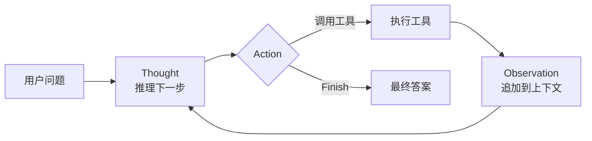

# Day 06 · ReAct（2026-10-04）

> ⚠️ 本次运行说明：定时任务运行时 WebFetch 的访问权限请求无人确认，**官方页面没能在本次重新打开核实**，只完成了 WebSearch（确认了下列页面存在）。本篇的 API 写法只使用此前笔记（Day 3–5）已核实过的稳定接口；涉及 thinking 的参数细节请以官方文档为准。

## 一句话总结

ReAct = **Reasoning + Acting**：让模型交替输出「思考（Thought）→ 行动（Action，调工具）→ 观察（Observation，工具结果）」，直到给出最终答案。它把"只想不做"的 CoT 和"只做不想"的工具调用合在一起：**推理决定下一步做什么，观察结果又修正推理**。今天的 Function Calling Agent（LangChain `create_agent`、Claude tool use 循环）本质上就是 ReAct 的原生实现，区别只是 Action 从"文本里解析"变成了"结构化 `tool_use` 块"。

## 核心概念

Day 3 讲了 Agent loop 的骨架，Day 4–5 讲了工具调用和工具设计。今天讲这套循环的"祖师爷"——ReAct 范式，以及它为什么有效、怎么手写、哪里会坏。

### 1. 出处与动机（非 LangChain/Claude 来源：原始论文）

- 论文：Yao et al., *ReAct: Synergizing Reasoning and Acting in Language Models*（2022 提出，ICLR 2023）。
- 动机对比：

```
CoT（只推理）      Thought → Thought → Answer          问题：知识靠模型记忆，易幻觉、无法获取新信息
Act-only（只行动）  Action → Obs → Action → Obs → Answer  问题：没有"为什么这么做"，不会拆解和纠偏
ReAct             Thought → Action → Obs → Thought → … → Answer
                  推理帮助制定/调整计划；行动获取外部事实，压住幻觉
```

- 论文里的经典 Action 空间（HotpotQA / FEVER）：`Search[实体]`、`Lookup[关键词]`、`Finish[答案]`。论文的结论要点：ReAct 的轨迹**更可解释、更少幻觉**，并且与 CoT 结合（ReAct 不行时回退 CoT-SC，或反之）效果更好。

### 2. 一次 ReAct 轨迹长什么样

```
Question: 我车现在的电量够开到苏州吗？
Thought 1: 需要知道当前续航和到苏州的距离。先查续航。
Action 1: get_range[]
Observation 1: 剩余续航 180 km
Thought 2: 再查到苏州的路线距离。
Action 2: get_route[苏州]
Observation 2: 距离 105 km，预计 1h20m
Thought 3: 180 > 105，余量 75 km，够用。
Action 3: Finish[够，剩余续航 180km，路程 105km，到达后约剩 75km]
```



### 3. 两代实现：文本 ReAct vs 原生 Tool Calling ReAct

| | 文本 ReAct（2022 风格） | 原生 Tool Calling ReAct（现在主流） |
|---|---|---|
| Action 怎么表达 | 模型在文本里写 `Action: tool[input]`，代码用正则解析 | 模型输出结构化 `tool_use` 块（name + JSON input） |
| 怎么停下来等工具 | `stop` 序列（如 `"Observation:"`）截断生成 | `stop_reason == "tool_use"` |
| Thought 在哪 | 文本里的 `Thought:` 行 | 工具调用前的 text 块，或模型的 thinking（扩展/自适应思考） |
| 主要风险 | 格式漂移、解析失败、模型自己编造 Observation | 较少；schema 约束参数，可并行多个调用 |
| 框架 | 老版 LangChain `AgentExecutor` + ReAct prompt（已是遗留写法） | LangChain v1 `create_agent`、LangGraph、Claude tool use / Tool Runner |

面试要点：**"现在说 ReAct agent，一般指 tool-calling 循环"**。LangGraph 早期的预构建函数直接叫 `create_react_agent`，LangChain v1 把它统一成了 `langchain.agents.create_agent`。

### 4. Thought 在原生实现里去哪了？

- 没有显式 Thought 也能跑：模型内部也在"推理"，但不可见、不可审计。
- 三种让推理显式化的方式：
  1. **System prompt 要求**："调用工具前，先用一两句话说明你为什么调用它"（生成 text 块）。
  2. **Extended / Adaptive thinking**：Claude 原生的思考块；配合工具使用时，思考可以**穿插在工具调用之间**（interleaved thinking），即每拿到一个 Observation 都能再想一次——这就是"模型内置的 ReAct"。注意：多轮工具调用时要把上一轮的 thinking 块**原样回传**（官方有专门的 "Thinking in tool and multi-turn workflows" 文档）。
  3. **"think" 工具**：Anthropic 工程博客介绍的一个空操作工具 `think(thought)`，让模型在长工具链中途"停下来想一想"（例如核对政策、检查是否收集齐信息），在复杂策略遵循场景有明显提升。和 extended thinking 的区别：think 工具发生在**拿到工具结果之后**的回合中间，侧重处理新信息。

### 5. 常见失败模式（面试必问）

| 失败 | 表现 | 对策 |
|---|---|---|
| 死循环 / 重复动作 | 同一个工具同参数反复调 | 最大步数（LangGraph `recursion_limit`，超出抛 `GraphRecursionError`）；重复调用检测；错误信息里写"不要重试" |
| 编造 Observation | 文本 ReAct 中模型自己写出 `Observation:` 继续往下编 | `stop` 序列截断；改用原生 tool calling |
| 解析失败 | `Action:` 格式不对 | 解析失败时把错误作为 Observation 回给模型让它改格式；或用 schema 约束 |
| 过早 Finish | 信息没查全就作答 | prompt 要求"作答前确认已核实 X、Y"；加验证步骤（Day 8 反思） |
| 推理与行动脱节 | Thought 说查 A，Action 却查 B | 显式 thinking + 轨迹评测（Day 21） |
| 上下文膨胀 | Observation 太长，后面步骤质量下降 | 工具返回截断/摘要（Day 5）；上下文压缩（Day 13） |
| 贪心短视 | 一步一想，长任务效率低、易绕远 | 引入规划：Plan-and-Execute / ReWOO（Day 7） |

## 代码示例

为了看清"机制"，这里**手写文本版 ReAct**（与 Day 3 的原生 tool_use 循环互补）：用 `stop_sequences` 截断、正则解析 Action、把工具结果作为 Observation 回填，并加上步数上限和重复检测。

```python
# pip install -U anthropic ; export ANTHROPIC_API_KEY=sk-...
import re, anthropic

client = anthropic.Anthropic()
TOOLS = {
    "get_range": lambda _: "剩余续航 180 km",
    "get_route": lambda city: {"苏州": "距离 105 km", "南京": "距离 300 km"}.get(city, f"未知城市：{city}，请换一个城市名"),
}
SYSTEM = """你是车载助手，用 ReAct 格式逐步解决问题。可用工具：
- get_range[]：查询当前剩余续航
- get_route[城市]：查询到该城市的驾驶距离
每一步严格输出两行：
Thought: <你的推理>
Action: <工具名>[<参数>]   或   Action: Finish[<最终答案>]
不要自己编写 Observation，它会由系统提供。"""

def react(question: str, max_steps: int = 6) -> str:
    transcript, seen = f"Question: {question}\n", set()
    for step in range(1, max_steps + 1):
        resp = client.messages.create(
            model="claude-opus-5-5", max_tokens=300, system=SYSTEM,
            stop_sequences=["Observation:"],              # 关键：模型写到这里就停，等真实观察
            messages=[{"role": "user", "content": transcript}],
        )
        out = resp.content[0].text.strip()
        transcript += out + "\n"
        print(f"--- step {step} ---\n{out}")
        m = re.search(r"Action:\s*(\w+)\[(.*?)\]", out)
        if not m:
            obs = "格式错误：请按 'Action: 工具名[参数]' 输出。"
        elif m.group(1) == "Finish":
            return m.group(2)
        elif m.group(1) not in TOOLS:
            obs = f"不存在工具 {m.group(1)}，可用：{list(TOOLS)}"
        elif (key := m.group(0)) in seen:
            obs = "你已用相同参数调用过该工具，结果不会变化，请换一步或直接 Finish。"
        else:
            seen.add(key)
            obs = TOOLS[m.group(1)](m.group(2).strip())
        transcript += f"Observation: {obs}\n"
        print(f"Observation: {obs}")
    return "已达到最大步数，未能完成（应作为'被迫停止'上报，而不是当成成功）"

print("答案：", react("我现在的电量够开到苏州吗？到南京呢？"))
```

运行说明：`python day06.py`，观察每步的 Thought/Action/Observation；把 `stop_sequences` 删掉再跑一次，看模型是否会自己"编造" Observation——这就是原生 tool calling 取代文本 ReAct 的原因。生产里用 Day 3/5 的 `tool_use` 循环或 `create_agent`。

## 与 Android / 车载场景的联系

ReAct 的每一步都是一次 LLM 往返，车载语音对延迟敏感：确定性指令走意图路由，只有"续航够不够、要不要顺路充电"这类需要多步查证的问题才走 ReAct；并且可以把每步的 Thought 精简后通过 TTS/界面反馈（"正在查询路线…"），缓解等待感。

## 高频面试题

**Q1. 什么是 ReAct？它解决了什么问题？**
- Reasoning + Acting 交替：Thought → Action → Observation 循环，直到 Finish。
- 解决 CoT 只依赖内部知识导致的幻觉/信息过时（Action 获取外部事实），也解决纯 Act 不会拆解和纠偏的问题（Thought 制定和修正计划）。
- 附带好处：轨迹可解释、可调试、便于做轨迹评测。

**Q2. ReAct 和现在的 Function Calling Agent 是什么关系？**
- Function Calling Agent 是 ReAct 的原生实现：Action 由模型输出结构化 `tool_use`，停止靠 `stop_reason`，Observation 是 `tool_result`。
- 比文本 ReAct 更稳：不需要正则解析、参数受 schema 约束、可并行调用、不会编造 Observation。
- Thought 变成了可选的 text 块或 extended/interleaved thinking。LangGraph 的 `create_react_agent` → LangChain v1 `create_agent` 就是这条演进线。

**Q3（追问）. 文本版 ReAct 为什么要设置 stop 序列？不设置会怎样？**
- 模型是续写机器，写完 Action 后会顺势续写 `Observation: ...`，即**自己编造工具结果**并继续推理，整条轨迹建立在幻觉上。
- `stop=["Observation:"]` 让生成在需要外部信息处停下，由代码执行工具后填入真实结果。
- 原生 tool calling 中这个机制被 API 内置（遇到 tool_use 即结束本轮）。

**Q4（追问）. 有了 extended thinking，还需要 ReAct 里的 Thought 吗？"think" 工具又是干什么的？**
- 推理仍然需要，只是载体变了：thinking 块是模型原生的、可穿插在工具调用之间的 Thought（interleaved thinking）。多轮时需按官方要求回传 thinking 块。
- think 工具是一个无副作用的工具，让模型在拿到工具结果后、长链路中途显式停下来核对规则和信息完整性；适合策略复杂、需要逐条遵循规则的场景（如客服退改签）。
- 选择：简单任务都不需要；复杂推理优先 thinking；长工具链 + 策略合规场景考虑 think 工具，并用评测验证收益。

**Q5（场景）. 线上 ReAct Agent 出现"反复搜索同一个关键词、最后超时"，你怎么排查和修复？**
- 看 trace：是工具返回为空/报错信息不可操作，还是模型没意识到结果不会变化。
- 修工具：空结果返回"未找到，建议改用 X 或换关键词"；错误区分可重试/不可重试（Day 5）。
- 加护栏：同参数重复调用检测并回填提示；`recursion_limit`/最大步数；预算超限时结构化地"被迫停止"并上报。
- 根治：长任务加规划（Day 7）或反思（Day 8）；把失败轨迹加入评测集回归。

**Q6（场景）. 让你设计一个车载"出行助理"Agent，你会直接用 ReAct 吗？**
- 分流：高频确定指令（开空调、导航到家）走意图识别 + 直接执行，不进 ReAct。
- 开放多步问题（"周末去黄山，路上要充几次电、顺便订酒店"）用 ReAct/工具循环；步骤较多时先生成计划（Plan-and-Execute）再执行，减少 LLM 往返和延迟。
- 护栏：步数/时间上限、车控类工具需确认、行驶中只读优先；关键 Thought 精简后语音播报。

## 常见误区

1. **"ReAct 是一个框架/库"**：它是一种提示与控制范式（交替推理与行动），任何支持工具调用的循环都可以实现它，不绑定 LangChain。
2. **"Thought 越多越好"**：每一步推理都要花 token 和延迟；简单任务直接调工具更快。推理深度应按任务难度调（thinking 预算/effort 是旋钮）。
3. **"跑到最大步数就返回最后一句话当答案"**：被迫停止 ≠ 成功；要明确上报失败原因，否则下游会把半成品当结果用。

## 动手练习（30 分钟）

在上面的文本 ReAct 基础上：① 加一个 `find_chargers[城市]` 工具，问"去南京路上需要充电吗，在哪充？"，观察多跳推理；② 把同一个问题改用 Day 3 的原生 `tool_use` 循环实现，对比两者的步数、总 token（`resp.usage`）和出错率各跑 5 次；③ 故意让 `get_route` 对"南京"返回超时错误，分别试"Error"和"超时，请稍后重试一次；仍失败则告知用户无法获取"两种错误文案，看哪种能让 Agent 正常收尾。

## 延伸学习

- Claude Academy · Building with the Claude API（Tool use 与 Extended thinking 相关章节）：https://academy.claude.com/courses/building-with-the-claude-api
- LangChain 模板仓库 · react-agent（LangGraph 版最小 ReAct Agent）：https://github.com/langchain-ai/react-agent
- Anthropic Engineering · The "think" tool：https://www.anthropic.com/engineering/claude-think-tool

## 参考资料

> 本次运行 WebFetch 未获授权，下列页面仅通过 WebSearch 确认存在、未在本次重新阅读核实；标 ※ 的为此前笔记已核实页面。

- Anthropic Engineering · The "think" tool: Enabling Claude to stop and think：https://www.anthropic.com/engineering/claude-think-tool
- Claude Docs · Thinking in tool and multi-turn workflows：https://platform.claude.com/docs/en/build-with-claude/thinking-tool-workflows
- Claude Docs · Adaptive thinking：https://platform.claude.com/docs/en/build-with-claude/adaptive-thinking
- Claude Cookbook · Extended thinking with tool use：https://platform.claude.com/cookbook/extended-thinking-extended-thinking-with-tool-use
- LangGraph · GRAPH_RECURSION_LIMIT：https://docs.langchain.com/oss/python/langgraph/errors/GRAPH_RECURSION_LIMIT
- LangChain · What's new in LangChain v1：https://docs.langchain.com/oss/python/releases-v1
- GitHub · langchain-ai/react-agent：https://github.com/langchain-ai/react-agent
- ※ Building Effective AI Agents：https://www.anthropic.com/engineering/building-effective-agents
- ※ Claude Academy · Building with the Claude API：https://academy.claude.com/courses/building-with-the-claude-api
- 原始论文（非 LangChain/Claude 来源，本次未打开）：Yao et al., ReAct: Synergizing Reasoning and Acting in Language Models, arXiv:2210.03629
