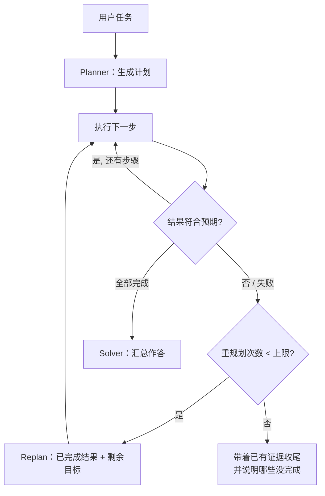

# Day 07 · 规划（Planning）（2026-10-05）

> ⚠️ 本次运行说明：定时任务里 LangChain 域名（docs.langchain.com、langchain.com/blog、github.com/langchain-ai）的 WebFetch 权限请求无人确认，**这些页面只通过 WebSearch 确认存在，没能打开核实**；Anthropic / Claude 官方页面已打开阅读。因此代码示例只用 Anthropic SDK 里此前笔记已核实过的稳定接口（`messages.create` + 工具 + `tool_choice`），LangChain 部分只讲概念，具体 API 名称请以官方文档为准。

## 一句话总结

规划就是**先想清楚"分几步、每步做什么"再动手**：ReAct 每步只看眼前一步（贪心），而 Plan-and-Execute 先由 Planner 生成完整步骤，再由 Executor 逐步执行，执行结果和预期不符时**重新规划（Replan）**；ReWOO 更进一步，把工具调用和变量引用（#E1）在计划里一次写好，执行阶段不再调 LLM，省 token、省延迟。代价是灵活性下降，所以生产上常见的折中是"轻量计划（todo 列表）+ ReAct 执行 + 按需重规划"。

## 核心概念

Day 6 的 ReAct 结尾留了一个问题：一步一想，长任务效率低、容易绕远。今天就讲解决这个问题的几种规划方法。

### 1. 为什么需要规划

| ReAct 的问题 | 规划怎么解决 |
|---|---|
| 每一步都要用大模型推理一次，步骤多时又慢又贵 | 只在规划时用强模型，执行可以用小模型，或者干脆不用 LLM |
| 只看眼前一步，长任务容易丢目标、绕远路 | 显式写出全局步骤，每步都知道自己在整体里的位置 |
| 进度在上下文里，上下文一满就忘了做到哪 | 计划写进状态或文件，可持久化、可恢复 |
| 中间过程不可见 | 计划可以拿给用户审批（人在回路，Day 24） |

Anthropic 在 *Building Effective Agents* 里的说法：任务明确后，Agent "plan and operate independently"，执行中要从环境拿到 **ground truth**（工具结果、代码运行结果）来判断进度，并可以在检查点停下来等人确认；同时必须有停止条件（如最大迭代次数）。

### 2. 三种经典架构（概念出自 LangChain 博客 *Plan-and-Execute Agents*）

```
① Plan-and-Execute
   Planner(强模型) ──> [step1, step2, step3]
        ▲                    │
        │ Replan             ▼
        └──── 结果不符 ── Executor(可以是一个 ReAct 子 Agent，逐步执行)
                             │ 全部完成
                             ▼
                          最终答案

② ReWOO（Reasoning WithOut Observation）
   Planner 一次性输出带变量的计划：
     Plan: 查续航      #E1 = get_range[]
     Plan: 查距离      #E2 = get_route[南京]
     Plan: 查充电站    #E3 = find_chargers[南京]
   Worker  按顺序执行，把 #E1 #E2 的结果代入后面的参数（不调 LLM）
   Solver  拿全部证据一次性作答

③ LLMCompiler
   Planner 流式输出任务的 DAG（依赖图）→ 任务调度器把没有依赖关系的任务并行执行 → Joiner 判断是直接作答还是重新规划
```

| | ReAct | Plan-and-Execute | ReWOO | LLMCompiler |
|---|---|---|---|---|
| 规划方式 | 每次只决定下一步 | 一开始出完整计划，可以重规划 | 一次出完整计划，步骤间用变量连接 | 一次出 DAG |
| 执行阶段调 LLM | 每步都调 | 每步可调（子 Agent） | 不调 | 不调（Joiner 才调） |
| 并行 | 靠模型一次发出多个工具调用 | 一般串行 | 串行 | 按依赖并行 |
| 适应性 | 最高 | 中（靠 replan） | 低（中途结果不会影响后面的计划） | 中 |
| 适合 | 短任务、探索性任务 | 多步、目标明确的任务 | 步骤可以预知、对成本敏感 | 大量互不依赖的工具调用、对延迟敏感 |

ReWOO 的局限要能讲出来：Planner 写计划时还**看不到任何观察结果**，如果第 2 步的结果应该改变第 3 步做什么（比如"续航足够就不用查充电站"），ReWOO 做不到，只能靠 Solver 收尾或整体重规划。

### 3. 重新规划（Replan）：什么时候触发

- **执行失败**：工具报错，或者前提不成立（城市不存在、没有权限）。
- **结果和计划的假设冲突**：计划假设"需要充电"，查完发现续航够。
- **按检查点触发**：每完成 N 步，或者每完成一个阶段，就复核一次剩余计划。
- **用户插话改需求**：多轮场景很常见。

设计要点：重规划时把**已完成步骤和结果**交给 Planner，让它"只规划剩余步骤"，不要从零开始，否则会重复执行有副作用的步骤（这和 Day 5 讲的幂等是一回事）。再设一个**重规划次数上限**，防止无限重规划。

### 4. 现在生产里的主流做法：轻量计划 + 动态执行

完整的 Plan-and-Execute 图在生产里越来越少，更常见的是把"计划"变成 Agent 自己维护的**一个工具或一份文件**：

- **Todo 工具**：Claude Code 的 todo 列表、LangChain Deep Agents 的 `write_todos` 工具（以 middleware 形式提供）。模型自己写计划、自己更新状态（pending / in_progress / completed），执行仍然是 ReAct 循环。计划随时可以改，所以不需要单独的重规划节点。（注：搜索结果显示 deepagents 仓库近期有 PR 把 todo 列表改成可选开启，具体默认行为以当前文档为准。）
- **扩展思考里的规划**：Anthropic 的多智能体研究系统中，Lead Agent "uses thinking to plan its approach"，决定用哪些工具、问题复杂度如何、派几个子 Agent、每个子 Agent 负责什么。子 Agent 拿到工具结果后用 **interleaved thinking** 评估结果质量、找出缺口、调整下一步，相当于每一步都在做小规模重规划。
- **计划持久化**：同一篇文章提到 Lead Agent 会"saving its plan to Memory"，因为上下文超过 200K token 会被截断，计划必须存在上下文之外。
- **长任务的计划 = 结构化的进度文件**：Anthropic 的 *Effective harnesses for long-running agents* 里，先由 Initializer Agent 生成一份 **JSON 功能清单**（每项带 `passes` 布尔字段）、`claude-progress.txt` 进度日志和第一次 git commit；之后每个会话的 Coding Agent 只做**一个功能**，做完更新状态再提交。Prompt 里明确要求 Agent 只能修改 `passes` 字段，不能删除条目。它针对的失败模式有三种：**一次做完整个项目（one-shotting）**、**做了一部分就宣布完成**、**没测试就标记完成**。

### 5. 任务分解的质量：比"分几步"更重要的是每步写清楚

Anthropic 研究系统的经验：Lead Agent 给子 Agent 布置任务时，要写清楚 **目标（objective）、输出格式、该用哪些工具和信息源、任务边界**。描述太模糊会导致子 Agent 重复工作或者做偏。另外要**按复杂度分配投入**，并把规则写进 prompt：简单的事实查询只需 1 个 Agent、3–10 次工具调用；直接对比类问题需要 2–4 个子 Agent，每个 10–15 次调用。

和 workflow 的区别（Day 3）：**Prompt Chaining** 的子任务是开发者预先定好的；**Orchestrator-Workers** 的子任务由编排者根据输入动态决定。官方原话："subtasks aren't pre-defined, but determined by the orchestrator based on the specific input."



## 代码示例

ReWOO 风格的"规划 → 无 LLM 执行 → 失败则重规划 → 汇总"。Planner 用**强制工具调用**（`tool_choice`）输出结构化计划，比解析文本更稳。

```python
# pip install -U anthropic ; export ANTHROPIC_API_KEY=sk-...
import json, anthropic

client = anthropic.Anthropic()
MODEL = "claude-opus-5-5"
TOOLS = {
    "get_range":     lambda a: "剩余续航 180 km",
    "get_route":     lambda a: {"苏州": "105 km", "南京": "300 km"}.get(a.get("city"), "ERROR: 未知城市，请用标准城市名如『南京』"),
    "find_chargers": lambda a: f"去{a.get('city')}沿途：阳澄湖服务区(120km 处)、梅村服务区(160km 处)",
}
PLAN_TOOL = {
    "name": "submit_plan",
    "description": "提交执行计划。每步只调用一个工具；args 的值可以写成 '#E1' 来引用前面步骤的结果。",
    "input_schema": {"type": "object", "required": ["steps"], "properties": {"steps": {"type": "array", "items": {
        "type": "object", "required": ["id", "tool", "args"],
        "properties": {"id": {"type": "string", "description": "步骤编号，如 E1"},
                       "tool": {"type": "string", "enum": list(TOOLS)},
                       "args": {"type": "object", "description": "get_range 无参数；其余工具传 {city}"}}}}}},
}

def plan(task: str, evidence: dict) -> list[dict]:
    prompt = f"任务：{task}\n请为它制定最少步骤的工具调用计划。"
    if evidence:  # 重规划：告诉 Planner 已经做了什么、哪里失败
        prompt += f"\n已执行结果（含失败）：{json.dumps(evidence, ensure_ascii=False)}\n只规划剩余步骤，编号不要和已有的重复。"
    r = client.messages.create(model=MODEL, max_tokens=1024, tools=[PLAN_TOOL],
                               tool_choice={"type": "tool", "name": "submit_plan"},  # 强制输出计划
                               messages=[{"role": "user", "content": prompt}])
    return next(b.input for b in r.content if b.type == "tool_use")["steps"]

def run(task: str, max_replans: int = 2) -> str:
    evidence, steps = {}, plan(task, {})
    for attempt in range(max_replans + 1):
        failed = False
        for s in steps:  # Worker：照计划执行，不调用 LLM
            args = {k: evidence.get(v.lstrip("#"), v) if isinstance(v, str) and v.startswith("#") else v
                    for k, v in s.get("args", {}).items()}
            out = TOOLS[s["tool"]](args)
            evidence[s["id"]] = out
            print(f"[{attempt}] {s['id']} {s['tool']}({args}) -> {out}")
            if out.startswith("ERROR"):
                failed = True
                break  # 现实和计划不符，触发重规划
        if not failed or attempt == max_replans:
            break
        steps = plan(task, evidence)
    r = client.messages.create(model=MODEL, max_tokens=512, messages=[{"role": "user", "content":
        f"任务：{task}\n证据：{json.dumps(evidence, ensure_ascii=False)}\n只根据证据简洁作答，证据不足就直接说明。"}])
    return next(b.text for b in r.content if b.type == "text")  # Solver

print(run("我现在的电量够开到南京吗？不够的话在哪充电？"))
```

运行说明：`python day07.py`，可以看到计划一次生成、执行阶段没有 LLM 往返，最后只调一次 Solver。把问题里的"南京"改成"南京市"，`get_route` 会报错，可以观察重规划的过程。

## 与 Android / 车载场景的联系

车载出行助理是规划的典型场景：像"周末去黄山，规划充电和住宿"这种任务，先生成计划并在屏幕上以卡片形式展示（用户能看到、能修改），再逐步执行。执行阶段不调 LLM（ReWOO 风格），能明显降低车机端到云端的往返延迟。

## 高频面试题

**Q1. ReAct 和 Plan-and-Execute 的区别？各自适合什么场景？**
- ReAct：每一步都根据最新的观察决定下一步，适应性强，但 LLM 调用次数多、长任务容易丢目标。适合短任务和探索性任务。
- Plan-and-Execute：先出全局计划再执行，执行器可以用小模型，计划可以持久化、可以给人审核，通过 replan 应对变化。适合多步骤、目标明确的任务。
- 实际常常混合使用：计划层用 Plan-and-Execute，每一步内部用 ReAct 子 Agent 执行。

**Q2. ReWOO 为什么省 token？它的代价是什么？**
- 省在哪里：ReAct 每一步都要把完整历史（包括所有观察）重新送进模型；ReWOO 只调用两次 LLM（Planner 和 Solver），Worker 只负责执行工具和代入变量。
- 代价：规划时看不到观察结果，没法根据中间结果调整后面的步骤，对 Planner 质量的依赖很强；某一步失败，后面依赖它的步骤都会失效，需要额外的重规划机制。

**Q3（追问）. 重规划时，为什么要把已完成步骤交给 Planner，而不是让它从头再规划一次？**
- 避免重复执行有副作用的步骤（重复下单、重复发消息），这和幂等设计（Day 5）是一回事。
- 节省成本，也能保留已经拿到的证据。
- 失败信息本身就是重规划需要的关键输入（为什么失败、哪些前提不成立）。
- 还要设重规划次数上限，超过后带着已有证据收尾，并明确说明哪些部分没完成。

**Q4（追问）. 现在大家都用 todo 工具，而不是完整的 Plan-and-Execute 图，为什么？**
- 新一代模型的长程推理能力变强了，计划可以交给模型自己维护：写 todo、更新状态，随时修改，不需要单独的 replan 节点。
- 实现简单：本质上还是一个 ReAct 循环，加上一个往状态里写数据的工具。
- 计划对用户可见（前端可以直接渲染 todo 列表），进度也清楚。
- 但对于成本和延迟敏感、步骤又固定的场景，ReWOO 或固定 workflow 仍然更合适。

**Q5（场景）. 让你做一个需要连续跑几个小时、跨多个会话的 Agent（比如自动开发一个 App），怎么设计它的规划和进度管理？**
- 拆成初始化阶段和执行阶段：先生成结构化的功能清单（JSON，每项有通过/未通过状态），再写一个进度日志，做一次初始 git commit。
- 每个会话只做一个功能：读进度文件和 git log → 选一个未完成的功能 → 实现 → 端到端测试通过后才标记完成 → 提交代码，同时更新进度。
- 防止三种失败：一口气全做、做了一部分就宣布完成、没测试就标记完成。限制 Agent 只能修改状态字段、不能删除条目。
- 计划和进度都要存在上下文之外（文件或 git），这样上下文被截断或压缩后还能恢复。

**Q6（场景）. 你的 Plan-and-Execute Agent 生成的计划经常太长、太细，执行起来又慢又容易出错，怎么优化？**
- 在 prompt 里约束：要求"最少步骤"，限定每步只能调用一个工具，并给出复杂度和步数的对照规则（参考 Anthropic 按复杂度分配资源的做法）。
- 调整粒度：把常一起出现的步骤合并成面向任务的工具（Day 5）。
- 用结构化输出约束计划格式，工具名用 enum 限定，防止编造不存在的工具。
- 做评测：建一组任务和参考计划的对照集，对比步数、成功率和成本（Day 21）。

## 常见误区

1. **"有了计划就一定照着执行"**：计划只是假设，必须设计重规划的触发条件和次数上限，否则一步失败，整条计划都会跟着失败。
2. **"规划越细越好"**：步骤越多，累计出错的概率越大，延迟和成本也越高。简单任务直接用 ReAct，甚至直接用 workflow 就够了。
3. **"计划放在对话上下文里就行"**：长任务的计划要持久化（状态、文件、git），否则上下文一压缩就丢了。

## 动手练习（30 分钟）

在上面的代码基础上：① 加一个 `book_hotel{city}` 工具（有副作用），故意让 `find_chargers` 第一次报错，检查重规划后 `book_hotel` 会不会被执行两次，如果会，加一个"已执行的有副作用步骤不再执行"的保护；② 把 Worker 改成 Day 6 的 ReAct 执行器（每一步交给 LLM 执行），用 `resp.usage` 对比两种方式的总 token 数和耗时；③ 给 Planner 加一句"续航足够时不需要查充电站"，看 ReWOO 能不能做到，并解释原因。

## 延伸学习

- Anthropic Cookbook · Orchestrator-workers（动态任务分解的最小实现）：https://platform.claude.com/cookbook/patterns-agents-orchestrator-workers
- LangChain 官方教程 · Build a deep research agent（Deep Agents 的规划与子 Agent，本次未打开）：https://docs.langchain.com/oss/python/deepagents/deep-research
- LangChain 官方课程仓库 · deep-agents-from-scratch（本次未打开）：https://github.com/langchain-ai/deep-agents-from-scratch

## 参考资料

已打开阅读：
- Anthropic · Building Effective AI Agents：https://www.anthropic.com/research/building-effective-agents
- Anthropic Engineering · How we built our multi-agent research system：https://www.anthropic.com/engineering/multi-agent-research-system
- Anthropic Engineering · Effective harnesses for long-running agents：https://www.anthropic.com/engineering/effective-harnesses-for-long-running-agents
- Claude Cookbook · Orchestrator workers：https://platform.claude.com/cookbook/patterns-agents-orchestrator-workers

仅通过 WebSearch 确认存在（本次 WebFetch 未获授权，未阅读）：
- LangChain Blog · Plan-and-Execute Agents（Plan-and-Execute / ReWOO / LLMCompiler 的出处）：https://blog.langchain.com/planning-agents/
- LangChain Docs · Deep Agents overview：https://docs.langchain.com/oss/python/deepagents/overview
- LangChain Docs · Prebuilt middleware（Deep Agents）：https://docs.langchain.com/oss/python/deepagents/middleware
- GitHub · langchain-ai/deepagents PR #4929（todo 列表改为可选开启）：https://github.com/langchain-ai/deepagents/pull/4929
- 原始论文（非 LangChain/Claude 来源，本次未打开）：Xu et al., ReWOO: Decoupling Reasoning from Observations for Efficient Augmented Language Models, arXiv:2305.18323；Kim et al., An LLM Compiler for Parallel Function Calling, arXiv:2312.04511
