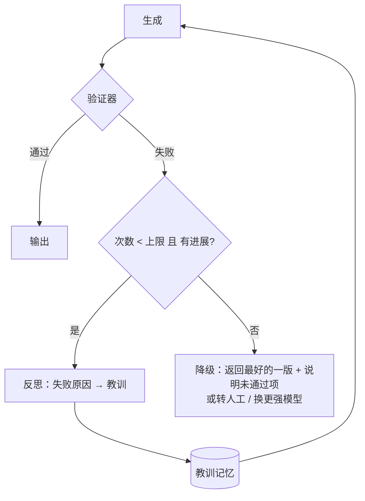

# Day 08 · 反思与自我纠错（Reflection & Self-Correction）（2026-10-06）

> ⚠️ 本次运行说明：定时任务里多数 WebFetch 权限请求无人确认被撤回。**已打开阅读**的只有：Claude Cookbook · Evaluator-optimizer、Claude 提示词最佳实践（Extended thinking tips）、Prompting Claude Opus 5、GitHub langchain-ai/langgraph-reflection。LangChain 博客 *Reflection Agents*、Anthropic *Building Effective Agents* / *Building agents with the Claude Agent SDK*、Reflexion 论文只通过 WebSearch 确认存在，相关描述来自此前笔记已核实内容或常识性概括，已在文中标注。代码只用此前笔记已核实过的 `messages.create` + 工具 + `tool_choice` 接口。

## 一句话总结

反思就是**在 Agent 循环里加一个"检查—反馈—修改"的回路**：生成结果后，由验证器（单元测试、规则、编译器，或另一个 LLM 当评审）给出反馈，生成器据此重做，直到通过或达到次数上限。关键原则是**能用确定性检查就别用 LLM 自评**——没有外部信号的"自我反省"很容易原地打转；Reflexion 的增量是把失败教训写成文字存进记忆，下一次尝试带着它。

## 核心概念

Day 7 的重规划解决的是"计划和现实不符"；今天解决的是"**这一步的产出本身有错**"。两者常一起出现：反思发现问题 → 局部重做；问题大到推翻前提 → 触发重规划。

### 1. 三个层次

```
① 基础反思（Basic Reflection / Self-Critique）
   Generator ──草稿──> Critic(LLM) ──批评──> Generator ──修改稿──> …
   缺点：批评者和生成者是同一个模型、同一份知识，没有新信息输入

② Evaluator-Optimizer（Anthropic 的工作流模式）
   Generator ──结果──> Evaluator ──PASS──> 输出
        ▲                │
        └──feedback──────┘ NEEDS_IMPROVEMENT / FAIL
   评审标准写死在 evaluator prompt 里，结构化输出状态 + 可执行的反馈

③ Reflexion（非 LangChain/Claude 来源：Shinn et al., 2023, arXiv:2303.11366）
   Actor 执行 → Evaluator 打分（常是外部信号：测试/环境奖励）
        → Self-Reflection 把失败总结成一段"教训"文字
        → 存入记忆（episodic memory）→ 下一次尝试带上这些教训
   本质：用"文字形式的反馈"代替梯度更新，不改模型权重
```

| | 基础反思 | Evaluator-Optimizer | Reflexion |
|---|---|---|---|
| 反馈来源 | 同一模型自评 | 独立评审 prompt（可换模型） | 外部信号 + 自我总结 |
| 跨尝试记忆 | 只有对话历史 | 历次结果 + 反馈 | 显式的"教训"列表 |
| 典型用途 | 改写作文、润色 | 翻译、代码质量、按标准打磨 | 代码生成、决策类任务的多次尝试 |

LangChain 博客 *Reflection Agents* 把这条线索整理成 Basic Reflection → Reflexion → LATS（把反思和蒙特卡洛树搜索结合）。（该博客本次未能打开，此处为概括。）

### 2. 什么时候用：Anthropic 的判断标准

Claude Cookbook 的 Evaluator-optimizer 示例：生成器在 `<thoughts>` 里写改进思路、`<response>` 里写方案；评审器按 "correctness, complexity, style" 打分，只输出 `PASS / NEEDS_IMPROVEMENT / FAIL` 加 `<feedback>`，循环到 `PASS` 为止。（注意：示例本身**没有次数上限**，生产里必须加。）

*Building Effective Agents* 给的适用条件（此前 Day 3 笔记已核实）可以概括成两条：
1. **有清晰的评估标准**；
2. **反馈确实能带来可测量的改进**——人给出反馈后结果明显更好，LLM 也能给出类似反馈。

### 3. 验证器的强弱排序（面试最常问）

```
确定性强 ─────────────────────────────────────────────> 确定性弱
单元测试/编译器/类型检查 > 规则校验(schema、正则、业务约束) > 截图/渲染比对 > LLM-as-judge > 同一模型自评
```

- **外部信号最可靠**：测试、lint、pyright、数据库约束。langgraph-reflection 的示例就是让 judge 跑 pyright，有问题就把结果作为一条 user 消息送回主 Agent："I ran pyright and found this: …"。
- **LLM-as-judge 用在没有客观标准的地方**（语气、完整性、是否回答了问题）。评审要给**具体、可执行**的反馈，而不只是分数。
- **纯自评的天花板**：没有新信息时，模型容易把对的改错、或反复说"看起来没问题"。所以要么换个视角（不同 prompt、不同模型），要么接外部工具。

### 4. 模型变强之后：别"过度验证"

Claude 官方提示词文档的新说法值得在面试里提：
- 对多数模型，在 prompt 末尾加一句 "Before you finish, verify your answer against [test criteria]" 能可靠地抓到错误，尤其是代码和数学。
- 开了 thinking 时，可以引导模型"拿到工具结果后先反思结果质量，再决定下一步"——这就是**每一步内置的小反思**（Day 7 讲的 interleaved thinking）。
- 但 **Claude Opus 5 会自己验证、自己纠错**，文档明确建议删掉 "double-check your answer""include a final verification step""use a subagent to verify" 这类指令，否则会 **over-verification**：多花 token 和延迟，质量没提升。

结论：反思机制的设计要**跟着模型能力调**。强模型上，外部确定性验证器依然值钱；"再检查一遍"这种提示词反而可能是负担。

### 5. 重试策略：工程上的细节



- **次数上限**：一般 2–3 次就够，收益递减明显。
- **"有进展"检测**：同样的错误连续出现 → 提前停止，不要空转。
- **保留最优版本**：后一次不一定比前一次好，按验证分数选最好的，而不是返回最后一次。
- **把失败信息原样带回**：报错堆栈、未通过的测试用例，比"请改进"有用得多。
- **区分错误类型**：网络超时这类瞬时错误用指数退避重试工具调用，**不需要反思**；逻辑错误才需要反思重写。
- **升级路径**：小模型失败 N 次 → 换大模型 / 转人工（Day 24）。

## 代码示例

Reflexion 风格：生成代码 → 跑测试（确定性验证器）→ 失败就让模型写一条教训 → 带着教训重试；保留最优版本。

```python
# pip install -U anthropic ; export ANTHROPIC_API_KEY=sk-...
import anthropic

client = anthropic.Anthropic()
MODEL = "claude-opus-5-5"
TASK = "写函数 parse_duration(s: str) -> int，把 '1h20m'、'45s'、'2h'、'1h0m30s' 这样的字符串转成秒数；非法输入抛 ValueError。"
TESTS = [("1h20m", 4800), ("45s", 45), ("2h", 7200), ("1h0m30s", 3630), ("", ValueError), ("3x", ValueError)]
CODE_TOOL = {"name": "submit_code", "description": "提交完整的 Python 代码（只含函数定义）",
             "input_schema": {"type": "object", "required": ["code"], "properties": {"code": {"type": "string"}}}}

def generate(lessons: list[str]) -> str:
    prompt = TASK + ("\n此前失败总结出的教训：\n- " + "\n- ".join(lessons) if lessons else "")
    r = client.messages.create(model=MODEL, max_tokens=2048, tools=[CODE_TOOL],
                               tool_choice={"type": "tool", "name": "submit_code"},
                               messages=[{"role": "user", "content": prompt}])
    return next(b.input["code"] for b in r.content if b.type == "tool_use")

def verify(code: str) -> list[str]:          # 确定性验证器：跑测试，返回失败明细
    ns: dict = {}
    try:
        exec(code, ns)                         # ⚠️ 演示用；生产必须放进沙箱（Day 19）
    except Exception as e:
        return [f"代码无法加载: {e!r}"]
    fails = []
    for arg, want in TESTS:
        try:
            got = ns["parse_duration"](arg)
            if want is ValueError or got != want:
                fails.append(f"parse_duration({arg!r}) 返回 {got!r}，期望 {getattr(want, '__name__', want)}")
        except Exception as e:
            if want is not ValueError:
                fails.append(f"parse_duration({arg!r}) 抛出 {e!r}，期望 {want}")
    return fails

def reflect(code: str, fails: list[str]) -> str:  # Self-Reflection：把失败压缩成一条可复用的教训
    r = client.messages.create(model=MODEL, max_tokens=300, messages=[{"role": "user", "content":
        f"代码：\n{code}\n未通过的测试：\n" + "\n".join(fails) + "\n用一句话总结根因和下次该怎么做，不要写代码。"}])
    return next(b.text for b in r.content if b.type == "text").strip()

def solve(max_tries: int = 3) -> str:
    lessons, best = [], (None, 10**9)
    for i in range(max_tries):
        code = generate(lessons)
        fails = verify(code)
        print(f"第 {i+1} 次：{len(fails)} 个失败", fails[:2])
        if len(fails) < best[1]:
            best = (code, len(fails))           # 保留最优版本，而不是最后一版
        if not fails:
            break
        lessons.append(reflect(code, fails))    # 教训写入"记忆"
    return best[0]

print(solve())
```

运行说明：`python day08.py`。强模型往往第一次就通过；想观察反思过程，可以往 `TESTS` 里加一条刁钻用例（如 `("1m1h", ValueError)` 要求顺序固定），看第二次是否根据教训修正。

## 与 Android / 车载场景的联系

车载 Agent 生成导航/空调等控制指令时，最适合用**确定性验证器**兜底：参数范围、车速状态（行驶中禁止某些操作）、指令 schema，不通过就带着错误原因让模型重写，而不是靠模型"自己再想想"。

## 高频面试题

**Q1. Reflection、Evaluator-Optimizer、Reflexion 有什么区别？**
- Reflection：同一模型生成后自评再改，没有新信息输入，效果有限。
- Evaluator-Optimizer：生成器和评审器分离，评审按明确标准输出状态 + 反馈，循环到通过。
- Reflexion：引入外部评估信号，并把失败总结成"文字教训"存进记忆，跨尝试复用；不更新模型权重。

**Q2. 什么样的任务适合加反思循环？什么时候不该加？**
- 适合：有清晰评估标准、反馈能带来可测量提升的任务——代码（有测试）、翻译、按规范生成文档、结构化抽取（有 schema）。
- 不该加：没有可靠评估标准（纯开放创作，评审只是换个口味）；延迟敏感的实时交互；强模型已经内置自检的简单任务——会过度验证、白花 token。

**Q3（追问）. LLM 自评不可靠，那你怎么让反思真正有效？**
- 优先接外部确定性信号：测试、编译器、类型检查、schema 校验、业务规则。
- 必须用 LLM 评审时：独立 prompt / 更强或不同的模型、给明确的评分标准（rubric）、要求输出具体可执行的反馈、评审看不到生成者的推理过程以免被带偏。
- 把失败信息原样带回（堆栈、失败用例），而不是笼统的"请改进"。
- 用离线评测验证反思循环真的提升了成功率（Day 21），而不是想当然。

**Q4（追问）. 重试多少次合适？怎么防止无限循环？**
- 设硬上限（常见 2–3 次），再加"无进展检测"：同一错误重复出现、分数不升反降就提前停。
- 保留每次的验证分数，最终返回最优版本。
- 超限后的降级：返回最好结果并标明未通过项、换更强模型、转人工。
- 区分瞬时错误（超时、限流 → 退避重试，不需要反思）和逻辑错误（才需要反思）。

**Q5（场景）. 你做的 SQL 生成 Agent 线上经常生成能执行但结果错误的 SQL，怎么加自我纠错？**
- 第一层确定性检查：语法解析 / `EXPLAIN` 通过、只允许 SELECT、表和字段在 schema 白名单里。
- 第二层执行反馈：在只读副本上跑，检查空结果、行数异常、类型不符，把这些信息作为反馈让模型修改。
- 第三层语义评审：LLM-as-judge 对照用户问题判断 SQL 是否回答了问题（比如漏了时间过滤）。
- 教训沉淀：把常见错误（如"订单表要过滤 is_deleted"）总结成规则，放进 system prompt 或检索记忆，这就是 Reflexion 思想的工程化。
- 上限 2–3 次，失败就把 SQL 和疑点一起展示给用户确认。

**Q6（场景）. 团队把模型升级到更强的版本后，发现响应变慢、token 涨了很多，但质量没变。你会排查什么？**
- 检查 prompt 和 harness 里是否残留"请再检查一遍""最后加一步验证""用子 Agent 验证"等指令——官方文档指出强模型（如 Claude Opus 5）会自己验证，这些指令会导致过度验证。
- 检查是否有外部 evaluator 循环对强模型已经多余，可以改为抽检或只在验证器报错时触发。
- 用评测集做 A/B：删掉冗余验证后质量不降、成本下降，就保留删除。

## 常见误区

1. **"加了反思就一定更好"**：没有外部信号的自评可能把对的改错；强模型上额外验证指令还会导致过度验证，白花 token 和延迟。
2. **"返回最后一次结果"**：多轮修改不保证单调变好，应按验证分数返回最优版本。
3. **"所有失败都交给反思"**：网络超时、限流是基础设施问题，用退避重试解决；让模型去"反思"一个 503 毫无意义。

## 动手练习（30 分钟）

在上面的代码基础上：① 把 `verify` 换成 LLM-as-judge（用 `tool_choice` 强制输出 `{status: PASS|FAIL, feedback}`），对比"测试验证"和"LLM 评审"各自漏掉了哪些错误；② 加"无进展检测"：连续两次失败用例完全相同就提前停止；③ 统计每次运行的总 `usage.output_tokens`，比较 `max_tries=1` 和 `max_tries=3` 的成本与通过率。

## 延伸学习

- Claude Cookbook · Evaluator-optimizer：https://platform.claude.com/cookbook/patterns-agents-evaluator-optimizer
- LangChain 官方仓库 · langgraph-reflection（`create_reflection_graph` 把主 Agent 和评审 Agent 组合起来）：https://github.com/langchain-ai/langgraph-reflection

## 参考资料

已打开阅读：
- Claude Cookbook · Evaluator optimizer：https://platform.claude.com/cookbook/patterns-agents-evaluator-optimizer
- Claude Docs · Prompting best practices（Extended thinking tips：self-check、反思工具结果）：https://platform.claude.com/docs/en/build-with-claude/prompt-engineering/extended-thinking-tips
- Claude Docs · Prompting Claude Opus 5（Task scope and over-verification、Self-correction）：https://platform.claude.com/docs/en/build-with-claude/prompt-engineering/prompting-claude-opus-5
- GitHub · langchain-ai/langgraph-reflection：https://github.com/langchain-ai/langgraph-reflection

仅通过 WebSearch 确认存在（本次 WebFetch 未获授权，未阅读）：
- LangChain Blog · Reflection Agents：https://blog.langchain.com/reflection-agents/
- Anthropic · Building Effective AI Agents（Evaluator-optimizer 的出处，Day 3 已读）：https://www.anthropic.com/research/building-effective-agents
- Anthropic · Building agents with the Claude Agent SDK（"verify work" 一节）：https://www.anthropic.com/engineering/building-agents-with-the-claude-agent-sdk
- 原始论文（非 LangChain/Claude 来源，本次未打开）：Shinn et al., Reflexion: Language Agents with Verbal Reinforcement Learning, arXiv:2303.11366
