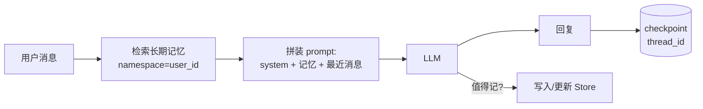

# Day 09 · 记忆机制（Memory）（2026-10-07）

## 一句话总结

LLM 本身是无状态的，Agent 的"记忆"全靠工程：**短期记忆**是同一会话（thread）里的消息历史，用 checkpoint 持久化，太长时靠裁剪/摘要/清理工具结果来压缩；**长期记忆**是跨会话的外部存储（按用户分命名空间的 KV/向量库，或 Claude 的 memory 文件目录），在需要时检索回上下文。设计重点不是"存得多"，而是**写什么、什么时候写、怎么取、何时忘**。

## 核心概念

Day 8 的 Reflexion 已经出现了"把教训存进记忆"——今天把记忆本身拆开讲。Day 13（上下文工程）会再深入 compaction 和 prompt caching，这里只讲到和记忆直接相关的部分。

### 1. 两条轴：作用范围 × 内容类型

```
                    ┌──────────── 作用范围 ────────────┐
                    短期记忆（thread 内）       长期记忆（跨 thread）
载体                 State.messages + checkpoint  Store / 向量库 / memory 文件
生命周期              一次会话                    跨会话、跨设备
典型问题              上下文越来越长              存什么、怎么检索、何时过期
```

LangGraph 文档把长期记忆按内容分成三类（借用认知科学的说法）：

| 类型 | 存什么 | Agent 里怎么用 |
|---|---|---|
| 语义记忆 Semantic | 事实：用户偏好、用户档案 | 检索后拼进 system prompt |
| 情景记忆 Episodic | 过去的经历/操作轨迹 | 当作 few-shot 示例 |
| 程序记忆 Procedural | 规则、指令 | 改写 system prompt 本身（Agent 自我更新指令） |

语义记忆又有两种组织方式：**Profile**（一份不断更新的 JSON 档案，适合字段固定的信息）和 **Collection**（一条条独立记录，召回率高但需要去重/合并）。

### 2. 短期记忆：checkpoint + 压缩

```
用户消息 ──> [thread_id=42 的 checkpoint 读出历史] ──> LLM ──> 写回 checkpoint
                          │
                 历史超过阈值？
                 ├─ 裁剪 trim：只留最后 N 条/N token（简单，但会丢早期关键信息）
                 ├─ 删除 RemoveMessage：精确删掉某些消息
                 ├─ 摘要 summarize：旧消息 → 一段摘要 + 保留最近 K 条
                 └─ 清理工具结果：旧的 tool_result 换成占位符（Claude 的 context editing）
```

- LangChain v1 里 `create_agent(..., checkpointer=InMemorySaver())`，调用时带 `{"configurable": {"thread_id": "1"}}` 即可续上会话；内置 `SummarizationMiddleware(model=..., trigger=("tokens", 4000), keep=("messages", 20))` 在超过阈值时自动摘要。
- Claude API 侧：**context editing**（beta 头 `context-management-2025-06-27`）的 `clear_tool_uses_20250919` 策略在输入超过 `trigger` 时清掉最旧的工具结果，保留最近 `keep` 个；还有服务端 compaction 自动摘要旧轮次。
- 裁剪工具调用时要注意**成对性**：别把 `tool_use` 留下而把对应 `tool_result` 删了，否则 API 直接报错。

### 3. 长期记忆：两种主流实现

**A. 框架管理的 Store（LangGraph）**——开发者决定读写时机

```python
store.put(("user_123", "memories"), "1", {"text": "I love pizza"})
store.search(("user_123", "memories"), query="hungry", limit=1)  # 配了 index 就是语义检索
```
命名空间是元组，通常 `(user_id, "memories")`，天然做到**用户隔离**。`InMemoryStore(index={"embed": ..., "dims": 1536})` 开启向量检索；生产换成 Postgres 等持久化实现。

**B. 模型自管理的文件记忆（Claude memory tool）**——模型决定读写时机

- 工具声明：`{"type": "memory_20250818", "name": "memory"}`，不需要写 schema，也不需要 beta 头。
- 命令：`view / create / str_replace / insert / delete / rename`，路径限定在 `/memories` 下。
- **客户端执行**：Claude 只发出"读/写哪个文件"的请求，存储由你实现（本地目录、数据库、S3 都行）。Python SDK 提供 `BetaLocalFilesystemMemoryTool` 现成实现和 `BetaAbstractMemoryTool` 基类。
- API 会自动注入一段协议提示："ALWAYS VIEW YOUR MEMORY DIRECTORY BEFORE DOING ANYTHING ELSE … ASSUME INTERRUPTION"——即"开工先看笔记、边做边记、随时可能被重置"。
- 安全：必须防**路径穿越**（`../`、URL 编码的 `%2e%2e%2f`），用 `Path.resolve()` + `relative_to()` 校验。

Anthropic 的 *Effective context engineering* 把 B 叫作 **structured note-taking**：Claude 玩宝可梦时在笔记里记"过去 1234 步一直在 1 号道路练级，皮卡丘已升 8 级，目标 10 级"，上下文被重置后读笔记接着干。

### 4. 写入时机：热路径 vs 后台

| | 热路径 Hot path | 后台 Background |
|---|---|---|
| 做法 | 对话中由 Agent 调用工具当场写 | 对话结束/定时由另一个流程抽取 |
| 优点 | 立即可用，用户可见（"已记住"） | 不增加响应延迟，主 Agent 逻辑简单 |
| 缺点 | 增加延迟，Agent 要同时想任务和记忆 | 有滞后，需要决定触发频率 |

### 5. 遗忘与记忆质量（最容易被追问）

- **更新而非追加**：新事实与旧事实冲突时（"我搬到上海了"），要 update/合并，不然检索出两条互相矛盾的记忆。
- **过期**：带时间戳/TTL；"用户此刻在开车"这类状态性信息根本不该进长期记忆。
- **用户可控**：可以查看、删除自己的记忆（合规要求，如个人信息删除权）。
- **记忆污染**：长期记忆是一个**持久化的注入入口**——外部网页里的恶意指令一旦被写进记忆，会在之后所有会话里生效（Day 23 安全会再讲）。写入前过滤，读出时当"数据"而不是"指令"。



## 代码示例

LangGraph：checkpoint 管短期、Store 管长期，用户说"记住…"时热路径写入，跨 thread 仍能取回。

```python
# pip install -U langgraph langchain langchain-anthropic ; export ANTHROPIC_API_KEY=sk-...
import uuid
from dataclasses import dataclass
from langchain.chat_models import init_chat_model
from langgraph.graph import StateGraph, MessagesState, START
from langgraph.checkpoint.memory import InMemorySaver
from langgraph.store.memory import InMemoryStore
from langgraph.runtime import Runtime

model = init_chat_model("anthropic:claude-opus-5-5")

@dataclass
class Context:
    user_id: str

def call_model(state: MessagesState, runtime: Runtime[Context]):
    ns = (runtime.context.user_id, "memories")          # 按用户隔离
    last = state["messages"][-1].content
    # 1) 写：热路径，用户显式要求时存一条（生产里应由 LLM 抽取 + 去重）
    if last.startswith("记住"):
        runtime.store.put(ns, str(uuid.uuid4()), {"text": last[2:].strip("：: ")})
    # 2) 读：取出该用户的长期记忆（未配 index 时是按命名空间列出）
    memories = [it.value["text"] for it in runtime.store.search(ns, limit=5)]
    system = "你是车载助手。已知用户信息：" + ("；".join(memories) or "无")
    reply = model.invoke([{"role": "system", "content": system}] + state["messages"])
    return {"messages": [reply]}

builder = StateGraph(MessagesState, context_schema=Context)
builder.add_node(call_model)
builder.add_edge(START, "call_model")
graph = builder.compile(checkpointer=InMemorySaver(), store=InMemoryStore())

def chat(text, thread_id, user_id="u1"):
    out = graph.invoke(
        {"messages": [{"role": "user", "content": text}]},
        {"configurable": {"thread_id": thread_id}},   # 短期记忆的 key
        context=Context(user_id=user_id),              # 长期记忆的 key
    )
    print(f"[{thread_id}] {out['messages'][-1].content}\n")

chat("记住：我喜欢空调 22 度，不喜欢听摇滚", thread_id="t1")
chat("我刚才说了什么？", thread_id="t1")       # 短期记忆：同 thread 能看到历史
chat("帮我把车里调舒服点", thread_id="t2")     # 新 thread：只能靠长期记忆知道 22 度
chat("帮我把车里调舒服点", thread_id="t3", user_id="u2")  # 另一个用户：取不到 u1 的记忆
```

运行：安装依赖、设置 `ANTHROPIC_API_KEY` 后 `python day09.py`；观察 t2 能用上 22 度、u2 不能。生产中把 `InMemorySaver/InMemoryStore` 换成 Postgres 实现，并给 Store 配 `index` 开启语义检索。

## 与 Android / 车载场景的联系

车机天然是"多用户共享一台设备"：长期记忆的命名空间要按**驾驶员身份**（账号/人脸/钥匙）切分，而不是按设备；"正在导航去公司"这类状态属于短期记忆，熄火即可清掉。类比 Android：checkpoint ≈ `SavedStateHandle`/进程恢复，Store ≈ Room/DataStore。

## 高频面试题

**1. Agent 的短期记忆和长期记忆分别是什么？各自怎么实现？**
- 短期：单个 thread 内的消息历史，存在 Agent state 里，用 checkpointer 按 `thread_id` 持久化，可恢复会话。
- 长期：跨 thread 的外部存储，按 `(user_id, ...)` 命名空间组织；LangGraph 用 Store（可配 embedding 做语义检索），Claude 用 memory tool 的 `/memories` 文件目录。
- 补一句：LLM 无状态，"记忆"本质就是**决定每次请求往上下文里放什么**。

**2. 对话越来越长，你怎么处理？（追问：摘要会丢信息怎么办？）**
- 方案梯度：裁剪最近 N 条 → 清理旧工具结果（往往占大头）→ 滚动摘要 + 保留最近 K 条 → 子 Agent 隔离上下文。
- 追问答法：① 关键事实在压缩**之前**写进长期记忆（Claude 的 context editing 会提示模型先把重要信息存到 memory 再清理）；② 摘要 prompt 明确要求保留：用户目标、已做决定、未完成事项、标识符（订单号、文件路径）；③ 保留最近 K 条原文；④ 用评测集对比压缩前后任务成功率。

**3. 记忆应该由开发者写，还是让模型自己通过工具写？**
- 开发者控制（固定节点/后台抽取）：可预测、易审计，适合字段固定的用户档案。
- 模型自管理（memory tool）：灵活，适合长任务的进度笔记和开放式知识，但需要防路径穿越、限制容量、审计写入内容。
- 实际常组合：后台流程维护 profile，模型自己记工作笔记。

**4. 向量记忆检索出来的内容不准或互相矛盾，怎么办？**
- 写入侧：抽取时去重、冲突时更新而非追加；带时间戳和来源。
- 检索侧：命名空间过滤 + 语义检索 + 按时间/重要性重排；设相似度阈值，宁缺毋滥。
- 使用侧：在 prompt 里注明"以下为历史记忆，可能过时，与用户当前说法冲突时以当前为准"。

**5. 场景题：设计一个车载语音助手的记忆系统，要求记住驾驶员偏好，支持多人共用一辆车。**
- 身份：按驾驶员账号分命名空间 `(driver_id, "prefs")`；无法识别身份时只用短期记忆，不写长期。
- 内容：语义记忆用 Profile（座椅、空调温度、常去地点、音乐偏好）；状态类信息（当前目的地）只放短期。
- 写入：后台抽取为主（不增加语音交互延迟），显式"记住…"走热路径并语音确认。
- 端云：Profile 本地缓存一份，离线可用；云端为准，登录时同步。
- 隐私：可在车机上查看/删除；位置类记忆设过期时间；记忆不跨账号共享。

**6. 追问：长期记忆有什么安全风险？**
- 记忆投毒：间接注入的恶意指令被写入记忆后，在之后所有会话持续生效。
- 越权读取：命名空间没按用户隔离导致串号；文件型记忆的路径穿越。
- 对策：写入前过滤和审批、读出时作为数据而非指令、严格的命名空间/路径校验、可审计和可删除。

## 常见误区

1. **"上下文窗口够大就不需要记忆设计"**：长上下文更贵更慢，模型也会被陈旧、无关内容干扰；而且窗口再大也跨不了会话。
2. **把所有对话原文都塞进向量库当"长期记忆"**：检索噪声大、矛盾信息多。应该抽取成事实/经验，并支持更新和删除。
3. **只设计写、不设计忘**：没有更新、过期和用户删除机制，记忆会越积越脏，还会触碰合规问题。

## 动手练习（30 分钟）

在上面的代码基础上：① 给 `InMemoryStore` 配 `index`（任意 embedding 模型），改用 `search(ns, query=最后一条消息, limit=3)` 做语义检索；② 实现"冲突更新"：写入前先检索相似记忆，如果是同一主题（如空调温度）就用同一个 key 覆盖而不是新增；③ 验证先说"喜欢 22 度"、再说"改成 24 度"后，新 thread 里只剩 24 度。

## 延伸学习

- Claude Academy · Claude Platform 101 · [Context management](https://academy.claude.com/courses/claude-platform-101/context-management)：just-in-time 上下文、服务端 compaction、prompt caching、memory tool 四件套，核心一句 "The goal isn't to fit everything in. The goal is to fit the right things in."
- LangChain 文档 · [Memory overview](https://docs.langchain.com/oss/python/langgraph/memory)（概念）和 [Memory（how-to）](https://docs.langchain.com/oss/python/langgraph/add-memory)（代码）

## 参考资料

- LangGraph · Memory overview：https://docs.langchain.com/oss/python/langgraph/memory
- LangGraph · Memory（add-memory how-to）：https://docs.langchain.com/oss/python/langgraph/add-memory
- LangChain · Short-term memory：https://docs.langchain.com/oss/python/langchain/short-term-memory
- Claude Docs · Memory tool：https://platform.claude.com/docs/en/agents-and-tools/tool-use/memory-tool
- Claude Docs · Context editing：https://platform.claude.com/docs/en/build-with-claude/context-editing
- Anthropic Engineering · Effective context engineering for AI agents：https://www.anthropic.com/engineering/effective-context-engineering-for-ai-agents
- Claude Academy · Claude Platform 101 · Context management：https://academy.claude.com/courses/claude-platform-101/context-management
